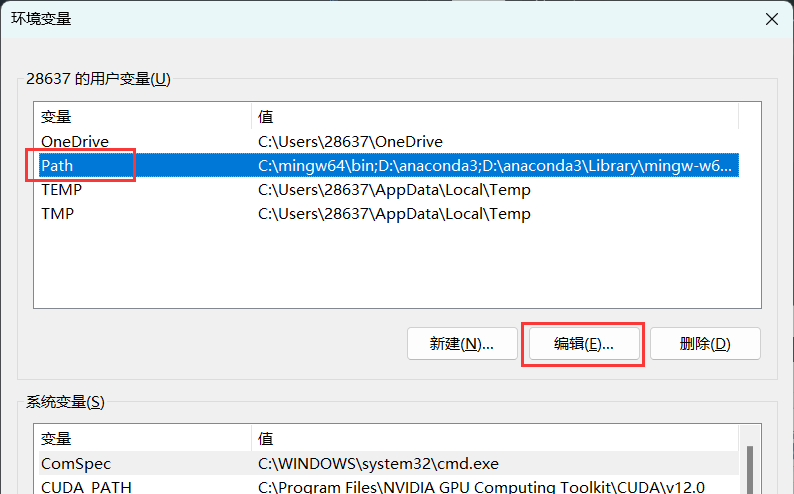
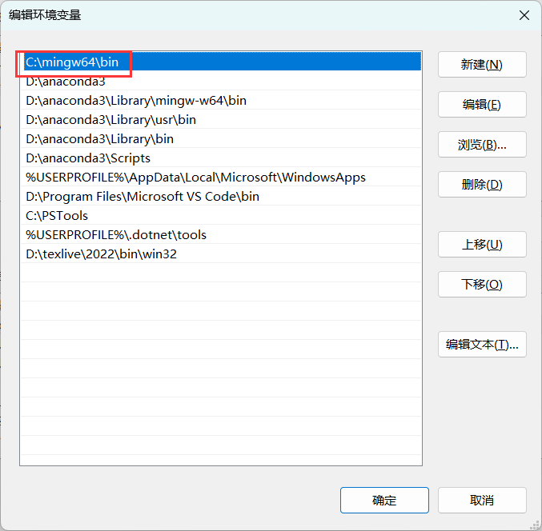

# 搭环境

GKxx, Caoster

---

# 前置知识

---

## 编辑器、编译器、IDE

- 编辑器：任何可以编辑文本的软件，例如记事本、Word、WPS文字、手机备忘录

---

## 编辑器、编译器、IDE

- 编辑器：任何可以编辑文本的软件，例如记事本、Word、WPS文字、手机备忘录
  - 但我们需要的是**代码编辑器**，尤其是**现代代码编辑器**：
  - `Notepad++`（不够现代）, `Visual Studio Code`, `Vim`, `Sublime Text`, ...

---

## 编辑器、编译器、IDE

- 编辑器：任何可以编辑文本的软件，例如记事本、Word、WPS文字、手机备忘录
  - 但我们需要的是**代码编辑器**，尤其是**现代代码编辑器**：
  - `Notepad++`（不够现代）, `Visual Studio Code`, `Vim`, `Sublime Text`, ...
- 编译器：用来将高级语言的代码“翻译”成计算机真正能执行的代码
  - 比较流行的C/C++编译器：`GCC`(GNU), `Clang`(LLVM), `MSVC`(Microsoft), `ICC`(Intel), ...

---

## 编辑器、编译器、IDE

- 编辑器：任何可以编辑文本的软件，例如记事本、Word、WPS文字、手机备忘录
  - 但我们需要的是**代码编辑器**，尤其是**现代代码编辑器**：
  - `Notepad++`（不够现代）, `Visual Studio Code`, `Vim`, `Sublime Text`, ...
- 编译器：用来将高级语言的代码“翻译”成计算机真正能执行的代码
  - 比较流行的C/C++编译器：`GCC`(GNU), `Clang`(LLVM), `MSVC`(Microsoft), `ICC`(Intel), ...
- IDE：**I**ntegrated **D**evelopment **E**nvironment（集成开发环境）：代码编辑器 + 编译器 + 调试器 + 项目管理工具 + ......
  
---

## 编辑器、编译器、IDE

- 代码编辑器：`Visual Studio Code`, `Vim`, `Sublime Text`, ...
- 编译器：用来将高级语言的代码“翻译”成计算机真正能执行的代码
- IDE：**I**ntegrated **D**evelopment **E**nvironment（集成开发环境）：代码编辑器 + 编译器 + 调试器 + 项目管理工具 + ......
  - 好的IDE有各种工具，例如 linter, profiler, sanitizer 等等
  - **宇宙最强IDE**：Microsoft Visual Studio
  - 常见的IDE：VS, CLion, PyCharm, ...

---

## 编辑器、编译器、IDE

- 代码编辑器：`Visual Studio Code`, `Vim`, `Sublime Text`, ...
- 编译器：用来将高级语言的代码“翻译”成计算机真正能执行的代码
- IDE：**I**ntegrated **D**evelopment **E**nvironment（集成开发环境）：代码编辑器 + 编译器 + 调试器 + 项目管理工具 + ......
  - 我们实际需要的是一个IDE
  - 你可以直接使用像CLion或VS这样的狠货，也可以用编辑器 + 编译器 + ... 自己搭一套。

---

# 安装编译器

GCC (MinGW) 和 Clang （可选）

---

## Linux（以Ubuntu为例）

- `sudo apt install gcc g++` 或者 `sudo apt install build-essential` 即可安装默认版本的 `gcc` 和 `g++`，在 Ubuntu 20.04 上安装的版本是 9。
- 添加 PPA源：`sudo apt-add-repository ppa:ubuntu-toolchain-r/test` 之后，`sudo apt install gcc-11 g++-11` 即可安装 11。在 Ubuntu 22.04 上还可以装 12。
- `wget https://apt.llvm.org/llvm.sh`
  `sudo chmod +x llvm.sh`
  `sudo ./llvm.sh 15`
  安装 `clang-15`（即最新版 `clang`）

---

## Windows

无法直接安装 `GCC`，我们需要 `MinGW`：**Min**imalist **G**NU for **W**indows.
- 实际上我们需要 `MinGW-w64`。`MinGW` 停止维护很久了。

[Winlibs](https://winlibs.com/)是个好东西
- 在**Download**下选择**UCRT runtime**中标有(**LATEST**)的那个 release 里的 Win64 Zip archive（建议选带有LLVM/Clang的）

#### 我不识字版：

[GCC 12.2.0 + Clang 15.0.7 + MinGW-w64 10.0.0 (UCRT) release 64, Win64 Zip](https://github.com/brechtsanders/winlibs_mingw/releases/download/12.2.0-15.0.7-10.0.0-ucrt-r4/winlibs-x86_64-posix-seh-gcc-12.2.0-llvm-15.0.7-mingw-w64ucrt-10.0.0-r4.zip)

---

## Windows

解压后将 `mingw64` 这个文件夹放在 C 盘或 D 盘，**路径最好简单一点**，例如 `C:\mingw64` 或者 `D:\mingw64`。

---

## Windows 环境变量

按 `Win` 键，输入 `env`，即可搜出这个选项

---

## Windows 环境变量

编辑 `Path`

---

## Windows 环境变量

新建一项，输入 `mingw64\bin` 所在的位置，最好把它移到最上面。

---

---

# 终端