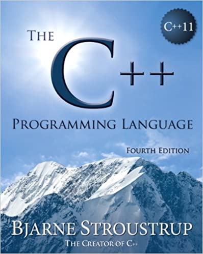
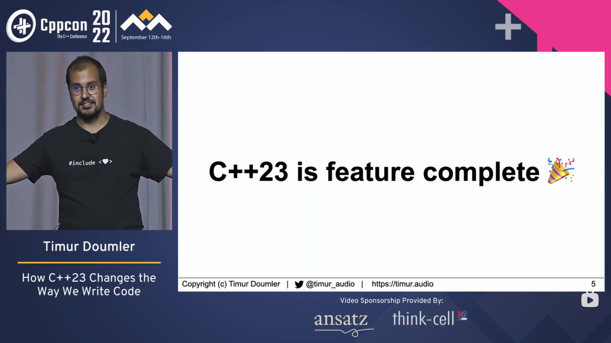
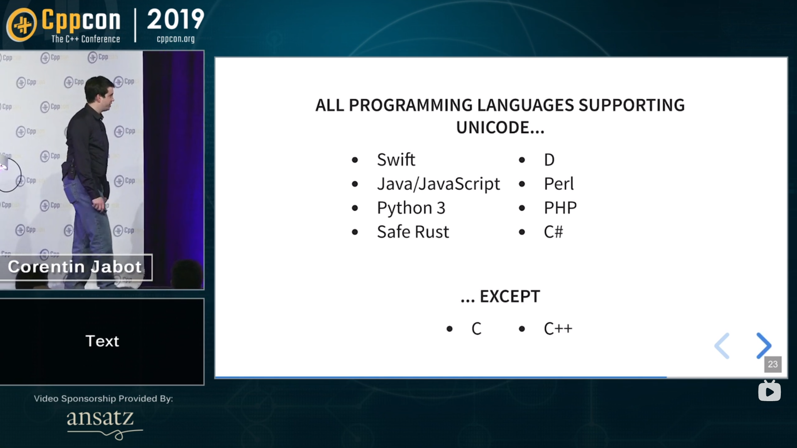

# CS100 Recitation 1

GKxx

---

## Contents

- C/C++ 语言标准
- 基本数据类型
- main 函数
- 运算符和表达式
- 说了 `Hello, world` 之后呢？

---

# C/C++ 语言标准

---

## C/C++ 的诞生

> 关于历史的部分我主要说 C++，因为比起 C 我更熟悉 C++。

- C 诞生于1972年的 Bell Laboratories，由 Dennis Ritchie 发明。
- 1979年，同样来自 Bell Lab 的 Bjarne Stroustrup 试图发明一种新的 C：
  - 它和 C 具有同等的抽象粒度，
  - 但吸收了一些好东西，尤其是来自 Simula 的“Class”和 strong static type checking。
- 1983年12月，“C with Classes” 正式更名为 “C++”。

---

---

## C++ 的诞生

彼时，C++ 的权威指南是1984年1月发布的第一份 C++ Manual。

1985年，Stroustrup 的著作《The C++ Programming Language》出版。

1990年：《The Annotated C++ Reference Manual》（*C++ ARM*）

1991年：《The C++ Programming Language》第二版。

---

## C++ 的诞生

与此同时，不断有新的特性加入 C++：

- 1990年7月：Templates
- 1990年11月：Exceptions
- 1993年3月：Run-time Type Identification (RTTI)
- 1993年7月：Namespaces
- 1994年：Standard Template Library (STL)

---

## 暂时尘埃落定：标准化

1998年，ISO/IEC 14882:1998 发布，即 C++ 的第一份 ISO 标准：**C++98**。

- C++ 正式拥有标准文档，而非借助著作、手册等作为参考。
- 标准化意味着不能随意变更，新特性要等下一个标准再加入。

---

## 标准化

1998年，ISO/IEC 14882:1998 发布，即 C++ 的第一份 ISO 标准：**C++98**。

- 2003年：“C++03”，是 C++98 的一份更正
- “C++0x”：新版本会在200x年到来？
- C++0x -> C++11，一份对于语言内核和标准库的大更新。
  - "C++11 feels like a new language."
  - "Modern C++"
- 自 C++11 起，每三年开一班列车：C++14, C++17, C++20, **C++23**, ...

---

---

## C 的标准化

- 第一份 C 语言标准：ISO/IEC 9899:1990 (C90)
  - ANSI X3.159-1989 (C89) 和 C90 是同一个语言。
- 1999年的 C99 加入了许多重要的东西，例如 `long long`，`bool`这样的类型。
  - 可惜 `long long` 没赶上 C++98，只能在 C++11 加入 C++ 标准，不过它早就被编译器支持了。
  - C++ 本来就有 `bool`。
- C 比 C++ 轻量很多，标准更新的频率也低一些。自 C11 起每 6 年一次：C11, C17, **C23**, ...

---

## 编译时设置语言标准

`gcc a.c -o a -std=c17`

`g++ a.cpp -o a -std=c++20`

- 试一试：`printf("%ld\n", __STDC_VERSION__)`
- C++：`std::cout << __cplusplus << std::endl;`

---

## 去哪看语言标准？

直接看标准文档：
- ISO 标准文档需要花钱购买
- open-std 有一些 working draft 可以免费下载，但是对初学者极不友好

一份友好的语言标准参考：[cppreference.com](cppreference.com)
- 以更友好、方便查找的方式对内容重新组织
- 大量地引用标准原文，保证内容的权威性
- 还包含 [compiler support](https://en.cppreference.com/w/cpp/compiler_support)、[experimental features](https://en.cppreference.com/w/cpp/experimental)、[常见第三方库](https://en.cppreference.com/w/cpp/links/libs) 等内容

---

# 基本数据类型

---

## 整数类型

- `short (int)`, `signed short (int)`, `unsigned short (int)`
- `int`, `signed (int)`, `unsigned (int)`
- `long (int)`, `signed long (int)`, `unsigned long (int)`
- `long long (int)`, `signed long long (int)`, `unsigned long long (int)`

---

## 整数类型

- `signed int` 和 `int` 是同一个类型吗？其它的呢？

---

## 整数类型

- `signed int` 和 `int` 是同一个类型吗？其它的呢？
  - 不带 `unsigned` 的都是带符号类型，`signed` 可以省略。
  - **例外：`char` 和 `signed char` 不是同一个类型，和 `unsigned char` 也不是。**

---

## 整数类型

- `signed int` 和 `int` 是同一个类型吗？其它的呢？
  - 不带 `unsigned` 的都是带符号类型，`signed` 可以省略。
  - **例外：`char` 和 `signed char` 不是同一个类型，和 `unsigned char` 也不是。**
- `int` 的大小（表示范围）是多少？`long` 呢？

---

## 整数类型

- `signed int` 和 `int` 是同一个类型吗？其它的呢？
  - 不带 `unsigned` 的都是带符号类型，`signed` 可以省略。
  - **例外：`char` 和 `signed char` 不是同一个类型，和 `unsigned char` 也不是。**
- `int` 的大小（表示范围）是多少？`long` 呢？
  - **implementation-defined**!
  - `short` 和 `int` 至少 16 位；`long` 至少 32 位；`long long` 至少 64 位。
  - `1 == sizeof(char) <= sizeof(short) <= sizeof(int) <= sizeof(long) <= sizeof(long long)`
  - https://en.cppreference.com/w/c/language/arithmetic_types

---

## 整数类型

表示范围：以 32 位整数为例（假设 `int` 是 32 位）

- `int` 的范围是 $\left[-2^{31}, 2^{31}-1\right]$
- `unsigned int` 的范围是 $\left[0, 2^{32}-1\right]$
  - `int` 和 `unsigned int` 能表示的数一样多
  - `int` 最高位是符号位，因此最大只能到 $2^{31}-1$。

---

## 布尔类型

- `<stdbool.h>` 定义了 `bool` 类型 (since C99)。
- `bool` 类型的变量有两种值：`true`（真）和 `false`（假）。
  - 在有 `bool` 之前人们一般用 `int` 代替 `bool`，用非零值表示 `true`，零表示 `false`。
  - C 是如此地偏爱 `int`，以至于 C23 之前 `true` 和 `false` 居然被 `#define` 为 `1` 和 `0`。（RTFSC）
  - C 的逻辑运算符和关系运算符的返回值类型也是 `int`，而非 `bool`。
  - 其实也可以不用知道。
- 和其它整数类型之间的转换：非零值 $\Rightarrow$ `true`，零 $\Rightarrow$ `false`；`true` $\Rightarrow$ `1`，`false` $\Rightarrow$ `0`。

---

## 字符类型

- `char`, `signed char`, `unsigned char`
- 另外有一些宽字符/Unicode字符类型：`wchar_t`, `char16_t`, `char32_t`
- `char` 既不是 `signed char`，也不是 `unsigned char`！它们是三种不同的类型
  - `char` 可能被实现为带符号的或不带符号的，这是 **implementation-defined behavior**。
- 至于宽字符/Unicode... 情况有些复杂
  - "That's what Python people laugh at."
  - 我们建议暂时避开这个问题。

---

---

## 究竟选哪个类型？

- 整数算术用 `int`。如果不够大，就用 `long long`。
- 该用布尔用 `bool`，尤其是在 C++ 中。
- 浮点数用 `double`。除非在特定场合中，否则 `float` 的精度经常不够用。
  - 不必担心 `double` 和 `float` 运算速度的差异。
  - `long double` 基本上用不到。

---

# main 函数

