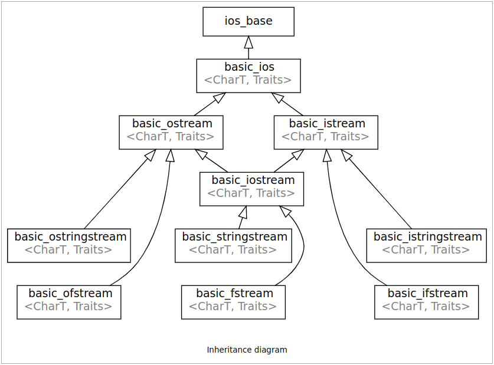
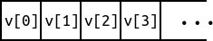
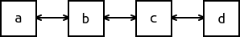
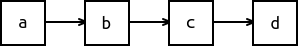

# CS100 Recitation 14

GKxx

---

## Contents

- 重载运算符：一些别的东西
- IOStream
- STL 总结、补充

---

## 思路打开

`std::string` 用 `operator+` 表示连接，很直观的设计。

但标准库 IOStream 用 `operator<<` 和 `operator>>` 来表示输入输出，甚至设计出连续的用法，的确是一种很巧妙的设计。

---

## 思路打开

`std::string` 用 `operator+` 表示连接，很直观的设计。

但标准库 IOStream 用 `operator<<` 和 `operator>>` 来表示输入输出，甚至设计出连续的用法，的确是一种很巧妙的设计。

难道 `+`, `-`, `*`, `/` 就只能用来完成加减乘除？

---

## `filesystem`：`operator/`, `operator/=`

`/home/gkxx/Courses/CS100/tmp`

```cpp
#include <iostream>
#include <filesystem>
int main() {
  namespace fs = std::filesystem;
  fs::path p = "/home/gkxx";
  p /= "Courses";
  p = p / "CS100" / "tmp";
  for (const auto &dir_entry : fs::directory_iterator(p))
    std::cout << dir_entry.path() << std::endl;
  return 0;
}
```

---

## `chrono`: `operator/` 和 literal suffix 配合使用 (C++20)

```cpp
#include <iostream>
#include <chrono>
int main() {
  using namespace std::chrono;
  auto date = 2021y/January/23d;
  std::cout << date << std::endl;
  return 0;
}
```

`2021y` 是一个 `std::chrono::year`，`std::chrono::January` 是一个 `std::chrono::month`，`23d` 是一个 `std::chrono::day`。

---

## `std::ranges`: `operator|` (C++20/23)

```cpp
#include <vector>
#include <ranges>
#include <iostream>
int main() {
  auto vec = std::views::iota(1, 5) // {1, 2, 3, 4}
           | std::views::transform([](auto x) { return x * 2; })
           | std::ranges::to<std::vector>();
  // vec is a std::vector<int>
  for (auto x : vec)
    std::cout << x << ' '; // 输出 2 4 6 8
  std::cout << std::endl;
  return 0;
}
```

[CppCon2022: Functional Composable Operations with Unix-Style Pipes](https://www.bilibili.com/video/BV1FB4y1H7VS/?p=7)

---

## `operator[]` 为什么一定是下标？

人家 Python Numpy 可以这样写

```python
a = np.array([-1, 2, -6, -3, 5])
b = (a > 0)  # [False, True, False, False, True]
c = a[a > 0] # [2, 5]
```

- 比较运算符返回一个 `bool` 数组
  - 比较运算符为什么一定是比较？
- `operator[]` 接受一个 `bool` 数组，返回一个新的数组

---

# IOStream 库

注：以下所有来自标准库的名字可能会省去 `std::`，但不代表我在代码里也会省去。

---

<a align="center">
  
</a>

---

## IOStream

`ifstream`, `ofstream`: 文件输入流，文件输出流，定义在 `<fstream>` 里

一般的文件流（默认情况下既可输入又可输出）：`fstream`

从文件读入：

```cpp
std::ifstream ifs("path/to/myfile.ext");
int ival; std::string s;
ifs >> ival >> s;
```

向文件写入：

```cpp
std::ofstream ofs("path/to/myfile.ext");
ofs << "hello world" << std::endl;
```

---

## fstream

打开文件的模式：`app`, `binary`, `in`, `out`, `trunc`, `ate`, (since C++23) `noreplace`

https://en.cppreference.com/w/cpp/io/basic_ifstream#Member_types_and_constants

通过 `|` 可以将多个模式并起来，例如 `std::ios::out | std::ios::binary`。

默认情况下：`ifstream` 使用 `in`，`ofstream` 使用 `out`，`fstream` 使用 `in | out`。

- 假如你传入的打开模式是 `mode`，`ifstream` 会以 `mode | in` 打开，`ofstream` 会以 `mode | out` 打开。
- `out` 会清空这个文件原来的内容，而 `app` 是将输出追加到原来的内容的后面。

```cpp
std::ofstream file("myfile.txt", std::ios::app);
file << "hello world" << std::endl;
```

---

## fstream

可以在构造的时候打开文件，并同时指定打开模式；也可以在稍后用 `open` 打开一个文件，或用 `close` 关闭打开的文件：

```cpp
std::ifstream file("myfile.txt", std::ios::binary);
if (!file.is_open()) {
  // myfile.txt is not found or cannot be opened.
  // handle this error.
  file.open("myfile.txt", std::ios::binary);
}
// do something with the file
file.close();
file.open("another_file.txt");
// ...
```

`file` 的析构函数会关闭打开的文件。

---

## stringstream

将一个 `std::string` 作为输入内容或输出结果

`istringstream`, `ostringstream`, `stringstream`：定义在 `<sstream>` 里。

```cpp
std::ostringstream oss;
oss << 42 << 3.14 << "hello world";
std::string str = oss.str(); // "423.14hello world"
```

---

## C++20 osyncstream

```cpp
#include <thread>
#include <syncstream>
#include <iostream>
#include <vector>
void thread_func(int id) {
  std::osyncstream(std::cout) << "hello world " << "from " << id << std::endl;
  // 如果直接用 std::cout，输出的内容就会乱作一团。
}
int main() {
  std::vector<std::thread> th; th.reserve(10);
  for (auto i = 0; i != 10; ++i)
    th.emplace_back(thread_func, i);
  for (auto &t : th) t.join();
  return 0;
}
```

---

# STL 总结、补充

注：以下所有来自标准库的名字可能会省去 `std::`，但不代表我在代码里也会省去。

---

## STL 概览

诞生于 1994 ~~梦想做...~~

- 容器 containers：顺序 (sequence) 容器，关联 (associative) 容器
- 迭代器 iterators：5 iterator categories
- 算法 algorithms
- 适配器 adapters：iterator adapters, container adapters
- 仿函数 function objects (functors)
- 空间分配器 allocators

---

## 容器

- 顺序容器 sequence containers
  - `vector`, `deque`, `list`, `array`, `forward_list`
- 关联容器 associative containers
  - `map`, `set`, `multimap`, `multiset`
  - `unordered_map`, `unordered_set`, `unordered_multimap`, `unordered_multiset`

---

## 顺序容器

- `vector<T>`：可变长数组，支持在末尾快速地添加、删除元素，支持随机访问 (random access)
  
<a align="center">
  
</a>

- `deque<T>`：双端队列 (**d**ouble **e**nded **que**ue)，支持在开头和末尾快速地添加、删除元素，支持随机访问

<a align="center">
  
</a>

---

## 顺序容器

- `list<T>`：双向链表，支持在任意位置快速地添加、删除元素，支持双向遍历，不支持随机访问

<a align="center">
  
</a>

- `forward_list<T>`：单向链表，支持在任意位置快速地添加、删除元素，仅支持单向遍历，不支持随机访问

<a align="center">
  
</a>

---

## 顺序容器

- `array<T, N>`：内置数组 `T[N]` 的套壳，提供和其它 STL 容器一致的接口（包括迭代器等），不会退化为 `T *`。
  - 用 `T[N]` 就像是坐在凳子上。用 `std::array<T, N>` 感觉像是坐在了沙发上，但其实就是在凳子上加了个垫子。
- 特别的：`string` 不是容器，但非常像一个容器

---

## 统一的接口：构造

- `Container c`：一个空的容器
- `Container c(n, x)`：`n` 个 `x`
- `Container c(n)`：`n` 个元素，每个元素都被值初始化
  - `string` 不支持这一操作，为什么？
- `Container c(begin, end)`：从迭代器范围 `[begin, end)` 中拷贝元素。

`array<T, N>` 只支持默认构造，为什么？

---

## 统一的接口：[完整列表](https://en.cppreference.com/w/cpp/container#Member_function_table)

相同的功能在所有容器上都具有相同的接口（除了 `forward_list` 有一点点特殊）

- 拷贝构造、拷贝赋值、移动构造、移动赋值
- `c.size()`, `c.empty()`, `c.resize(n)`
- `c.capacity()`, `c.reserve(n)`, `c.shrink_to_fit()`
- `c.push_back(x)`, `c.emplace_back(args...)`, `c.pop_back()`
- `c.push_front(x)`, `c.emplace_front(args...)`, `c.pop_front()`
- `c.at(i)`, `c[i]`, `c.front()`, `c.back()`
- `c.insert(pos, ...)`, `c.emplace(pos, args...)`, `c.erase(...)`, `c.clear()`

---

## 统一的接口

记忆的关键：

1. 理解每一种容器的底层数据结构，自然就明白为何支持/不支持某种操作
   - 为何链表不支持下标访问？为何 `vector` 不支持在开头添加元素？
2. 记住这些接口的名字
3. 如果一个操作应该被支持，它就必然叫那个名字、是那个用法

---

## `string` 和 `vector` 的“容量”

`string` 大概率和 `vector` 采用类似的增长方式，分配的内存可能比当前存储的元素所占用的内存大。
- 当前所拥有的内存能放下多少个元素，称为“容量” (capacity)，可以通过 `c.capacity()` 查询。
- `c.reserve(n)` 为至少 `n` 个元素预留内存。
  - 如果 `n <= c.capacity()`，什么都不会发生。
  - 否则，重新分配内存使得 `c` 能装得下至少 `n` 个元素。
  - **务必区分 `reserve` 和 `resize`。**
- `c.shrink_to_fit()`：**请求** `c` 释放多余的容量（可能重新分配一块更小的内存）
  - 这个函数在 `deque` 上也有。

---

## `insert` 和 `erase`

`c.insert(pos, ...)`, `c.emplace(pos, args...)`，其中 `pos` 是一个迭代器。

在 `pos` 所指的位置**之前**添加元素。

`insert` 有很多种写法，可以 `c.insert(pos, x)`, `c.insert(pos, begin, end)`, `c.insert(pos, {a, b, c, ...})` 等等，用到的时候再查。

`c.erase(...)` 也有很多种写法，用到的时候再查。

---

## 特殊的 `forward_list`

`forward_list` 的功能完全被 `list` 包含，那为何我们还需要 `forward_list`？

---

## 特殊的 `forward_list`

`forward_list` 的功能完全被 `list` 包含，那为何我们还需要 `forward_list`？

**为了省时间，省空间！**

- 单向链表的结点比双向链表的结点少存一个指针
- 维护单向链表上的链接关系也比维护双向链表少一些操作

因此，`forward_list` 采取最简的实现：能省则省

- 它不能 `push_back`/`pop_back`。
  - 如果需要，你可以自己保存指向末尾元素的迭代器。
- 它甚至不支持 `size()`。如果需要，你可以自己用一个变量记录。

---

## 特殊的 `forward_list`

`insert`, `emplace` 和 `erase` 变成了 `insert_after`, `emplace_after` 和 `erase_after`

- 单向链表上，操作“下一个元素”比操作“当前元素”或“前一个元素”更方便。
- 到 CS101 你们就知道咋回事了。

---

## 越界检查

`c.at(i)` 在越界时抛出 `std::out_of_range` 异常

`c[i]`, `c.front()`, `c.back()`, `c.pop_back()`, `c.pop_front()` 统统不检查越界，一切为了效率。

也许下面这种设计更合理？

```cpp
auto &operator[](size_type n) {
#ifndef NDEBUG
  if (n >= size())
    throw std::out_of_range{"subscript out of range"};
#endif
  return data[n];
}
```

---

## 选择正确的容器

顺序容器：
- 能维持元素的先后顺序
- 某些情况下的插入、删除、查找可能较慢。

关联容器（不带 `unordered` 的）：
- 元素总是有序的，默认是升序（因为底层数据结构通常是红黑树）
- 支持 $O(\log n)$ 地插入、删除、查找元素

无序关联容器（`unordered`）：
- 元素是无序的（因为底层数据结构是哈希表）
- 支持平均情况下 $O(1)$ 地插入、删除、查找元素

---

# 迭代器

---

## 假如没有迭代器...

不同的容器，根据底层数据结构不同，遍历方式自然也不同：

```cpp
for (std::size_t i = 0; i != a.size(); ++i)
  do_something(a[i]);
// 可能的方式：通过指向结点的“句柄”（指针）遍历一个链表
for (node_handle node = l.first_node(); node; node = node.next())
  do_something(node.value())
```

如果是个更复杂的容器呢，比如基于哈希表/红黑树实现的关联容器？

---

## 迭代器：使用统一的方式访问元素、遍历容器

所有容器都有其对应的迭代器类型 `Container::iterator`，例如 `std::string::iterator`, `std::vector<int>::iterator`。

所有容器都支持 `c.begin()`, `c.end()`，分别返回指向**首元素**和指向**尾后位置**的迭代器。

<a align="center">
  
</a>

**\* 我们总是使用左闭右开区间 `[begin, end)` 表示一个“迭代器范围”**

---

## 迭代器：使用统一的方式访问元素、遍历容器

- `it1 != it1` 比较两个迭代器是否相等（指向相同位置）
- `++it` 让 `it` 指向下一个位置。
- `*it` 获取 `it` 指向的元素的**引用**。

```cpp
for (auto it = c.begin(); it != c.end(); ++it)
  do_something(*it);
```

基于范围的 `for` 语句：完全等价于上面的使用迭代器的遍历

```cpp
for (auto &x : c)
  do_something(x);
```

---

## `const_iterator`

带有“**底层 `const`**”的迭代器。

- `Container::const_iterator`
- `c.cbegin()`, `c.cend()`
- 在一个 `const` 对象上，`c.begin()` 和 `c.end()` **也返回 `const_iterator`**。

对 `const_iterator` 解引用会得到 `const T &` 而非 `T &`，无法通过它修改元素的值。

---

## `begin`, `end`, `cbegin`, `cend`

再次出现了 `const` 和 non-`const` 的重载。

```cpp
class MyContainer {
 public:
  using iterator = /* unspecified */;
  using const_iterator = /* unspecified */;
  iterator begin();
  const_iterator begin() const;
  iterator end();
  const_iterator end() const;
  const_iterator cbegin() const;
  const_iterator cend() const;
};
```

---

## 迭代器型别 (iterator category)

- ForwardIterator: 支持 `*it`, `it->mem`, `++it`, `it++`, `it1 == it2`, `it1 != it2`
- BidirectionalIterator: 在 ForwardIterator 的基础上，支持 `--it`, `it--`。
- RandomAccessIterator: 在 BidirectionalIterator 的基础上，支持 `it[n]`, `it + n`, `it += n`, `n + it`, `it - n`, `it -= n`, `it1 - it2`, `<`, `<=`, `>`, `>=`。

`vector`, `string`, `array`, `deque` 的迭代器是 RandomAccessIterator；`list` 的迭代器是 BidirectionalIterator；`forward_list` 的迭代器是 ForwardIterator。

**为什么我这么喜欢在 `for` 循环的终止条件里写 `!=` 而非 `<`？**

---

## 迭代器型别 (iterator category)

- ForwardIterator: 支持 `*it`, `it->mem`, `++it`, `it++`, `it1 == it2`, `it1 != it2`
- BidirectionalIterator: 在 ForwardIterator 的基础上，支持 `--it`, `it--`。
- RandomAccessIterator: 在 BidirectionalIterator 的基础上，支持 `it[n]`, `it + n`, `it += n`, `n + it`, `it - n`, `it -= n`, `it1 - it2`, `<`, `<=`, `>`, `>=`。

`vector`, `string`, `array`, `deque` 的迭代器是 RandomAccessIterator；`list` 的迭代器是 BidirectionalIterator；`forward_list` 的迭代器是 ForwardIterator。

**为什么我这么喜欢在 `for` 循环的终止条件里写 `!=` 而非 `<`？**——不是所有迭代器都支持 `<`，但所有迭代器都支持 `!=`！

---

## 迭代器型别 (iterator category)

还有两种迭代器型别：InputIterator 和 OutputIterator。

- InputIterator 表示**可以通过这个迭代器获得元素**（不要求能修改它所指向的元素）
- OutputIterator 表示**可以通过这个迭代器写入元素**（不要求能获得它所指向的元素）

- A ForwardIterator **is an** InputIterator.

稍后我们会看到一些例子。

---

## 数组和指针

指针 `T *` 是数组 `T[N]` 的迭代器，那么它属于哪种 category？

---

## 数组和指针

指针 `T *` 是数组 `T[N]` 的 iterator, `const T *` 是其 const_iterator。

指针作为数组的迭代器，其型别为 RandomAccessIterator。

标准库 `std::begin(a)`, `std::end(a)`, `std::cbegin(a)`, `std::cend(a)`（定义在 `<iterator>` 等头文件中）：当 `a` 是数组时返回相应的指针，当 `a` 是容器时返回相应的迭代器。

---

## 反向迭代器 `reverse_iterator`

一种 iterator adaptor

- `Container::reverse_iterator`, `Container::const_reverse_iterator`
- `c.rbegin()`, `c.rend()`, `c.crbegin()`, `c.crend()`
- `++` 和 `--` 在反向迭代器上都是反的。

```cpp
std::vector v{1, 2, 3, 4, 5};
for (auto rit = v.rbegin(); rit != v.rend(); ++rit)
  std::cout << *rit << ' ';
```

输出：`5 4 3 2 1 `

---

## 移动迭代器 `move_iterator`

一种 iterator adaptor

- `std::make_move_iterator(iter)` 从一个普通的迭代器 `iter` 变出一个 move_iterator
- `*mit` 会得到右值引用而非左值引用，从而元素更可能被移动而非被拷贝。

```cpp
std::vector<std::string> words = someValues();
std::vector<std::string> v(words.size());
std::copy(std::make_move_iterator(words.begin()),
          std::make_move_iterator(words.end()), v.begin());
```

`words` 中的每个 `string` 被**移动**进了 `v`，而不是拷贝。

---

## 插入迭代器

`insert_iterator`, `front_insert_iterator`, `back_insert_iterator`

也属于 iterator adaptors。

典型的 OutputIterator：

- 只可向 `*iter` 写入元素，不能从 `*iter` 读取元素
- 它们会调用容器的 `insert`, `push_front` 或 `push_back`，将“写入”的元素插入容器

```cpp
std::vector<int> numbers = someValues();
std::vector<int> v;
std::copy(numbers.begin(), numbers.end(), v.begin()); // 错误！
std::copy(numbers.begin(), numbers.end(), std::back_inserter(v)); // 正确
```

`std::back_inserter(v)` 生成一个 `std::back_insert_iterator`，它会不断调用 `v.push_back(x)` 将向它“写入”的元素添加进 `v`。

---

## 流迭代器

读入一串数存进一个 `vector<int>`：

```cpp
std::vector<int> v(std::istream_iterator<int>(std::cin),
                   std::istream_iterator<int>{});
```

利用 `std::copy` 将 `v` 中的元素输出，并且每个后面跟一个 `", "`：

```cpp
std::copy(v.begin(), v.end(), std::ostream_iterator<int>(std::cout, ", "));
```

- `istream_iterator` 是一种 InputIterator，它不断从输入流中获取元素
- `ostream_iterator` 是一种 OutputIterator，它不断将向它“写入”的元素写进输出流

---

## 迭代器型别

InputIterator 和 ForwardIterator 都要求支持 `++it`, `it++`, `*it`, `it->mem`, `==`, `!=`。

这两类迭代器的区别究竟是什么？

---

## 迭代器型别

InputIterator 和 ForwardIterator 都要求支持 `++it`, `it++`, `*it`, `it->mem`, `==`, `!=`。

这两类迭代器的区别究竟是什么？—— ForwardIterator 提供 **multi-pass guarantee**

```cpp
auto original = iter;       // 对当前的 iter 做个拷贝
auto value = *iter;         // 现在 iter 指向的元素是 value
++iter;
assert(*original == value);
```

对于一个 ForwardIterator 来说，`original` 指向了 `iter` 在递增之前指向的位置，那个位置上的值始终是 `value`。

InputIterator 不这么认为，它只保证能“input”：`++iter` 就意味着我们打算获取“下一个值”了，先前的值也就无法再被获取了。（考虑“输入”的过程）
