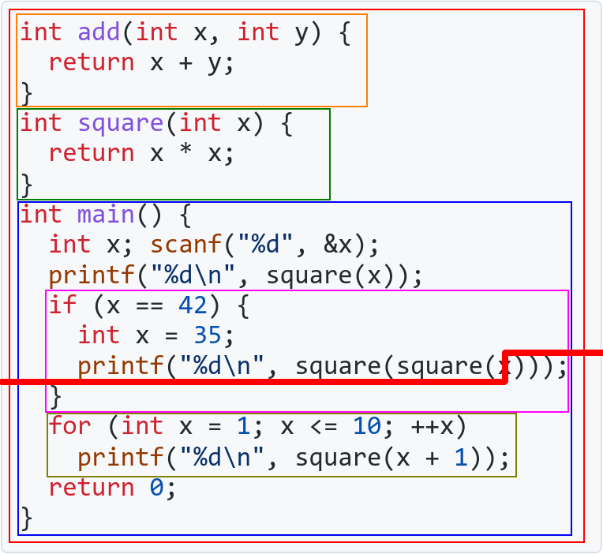

# CS100 Recitation 2

GKxx

---

# Contents

- 算术类型（续）
- 运算符和表达式（续）
- 控制流
- 变量命名、声明、初始化
- 名字查找

---

# 算术类型

---

## 字面值 (literals)

像 `42` 这样把值写在脸上的就是字面值。

- 整型字面值 (integer literals)：`42`, `100L`, `0ll`, `405ul`
  - 不写后缀，默认是 `int`，如果 `int` 不够大就是 `long`，还不够大就是 `long long`。还不够大的话：
    - 如果编译器支持 `__int128` 并且它够大，那就是 `__int128`
    - 否则报错 (ill-formed)。
  - 不存在负字面值：`-42` 是将一元负号 `-` 作用在字面值 `42` 上形成的表达式。
  - 后缀有 `u` (`unsigned`), `l` (`long`), `ll` (`long long`)。大小写不敏感，但是不可以是 `lL` 或 `Ll`。
  - 后缀可以任意组合。

---

## 字面值 (literals)

像 `42` 这样把值写在脸上的就是字面值。

- 整型字面值 (integer literal)：`42`, `100L`, `0ll`, `405ul`
  - 还可以有十六进制字面值：`0xBAADF00D`
  - 以及八进制字面值：`052`
  - 以及 C23 的二进制字面值：`0b101010`
    - 实际上编译器早就支持了，隔壁 C++14 就有二进制字面值了。
  - 这里所有的字母的大小写都随意。

---

## 字面值 (literals)

浮点数字面值：`3.14`, `3.14f`, `3.14l`, `1e8`, `3e-8`

- 不写后缀，默认是 `double`。`f` 是 `float`，`l` 是 `long double`，大小写不敏感。
- `1e8` 表示 $10^8$，但它是 `double` 而非整数。

字符字面值：`'a'`

- 猜猜 `'a'` 是什么类型？

---

## 字面值 (literals)

浮点数字面值：`3.14`, `3.14f`, `3.14l`, `1e8`, `3e-8`

- 不写后缀，默认是 `double`。`f` 是 `float`，`l` 是 `long double`，大小写不敏感。
- `1e8` 表示 $10^8$，但它是 `double` 而非整数。

字符字面值 (character literal)：`'a'`

- `'a'` 的类型居然是 `int`？？
- C++ 里它就是 `char` 了。

---

## 字符？一个小整数罢了

`char c = 'a';`

`c` 所存储的内容**就是**整数 `97`，即 `'a'` 的 ASCII 码，而非任何神秘的图像。

假如字符 `c` 是一个数字字符，如何获得它所表示的数值？

---

## 字符？一个小整数罢了

`char c = 'a';`

`c` 所存储的内容**就是**整数 `97`，即 `'a'` 的 ASCII 码，而非任何神秘的图像。

假如字符 `c` 是一个数字字符，`c - '0'` 就是它所表示的数值。

练习：实现一个函数 `is_lower`，接受一个 `char`，判断它是不是小写英文字母。

---

## 字符？一个小整数罢了

练习：实现一个函数 `is_lower`，接受一个 `char`，判断它是不是小写英文字母。

```c
bool is_lower(char c) {
  return c >= 'a' && c <= 'z';
}
```

练习：实现一个函数 `to_upper`，接受一个 `char`，如果它是小写英文字母就返回它的大写形式，否则返回它本身。

---

## 字符：一个小整数罢了

练习：实现一个函数 `to_upper`，接受一个 `char`，如果它是小写英文字母就返回它的大写形式，否则返回它本身。

```c
char to_upper(char c) {
  return is_lower(c) ? c - 32 : c;
}
```

### 条件运算符：

`condition ? exprT : exprF`

先对 `condition` 求值，如果为 `true` 则执行 `exprT`，否则执行 `exprF`

**为数不多的能确定运算对象求值顺序的运算符之一**

---

## 字符：一个小整数罢了

更直白一些：

```c
char to_upper(char c) {
  return is_lower(c) ? c - ('a' - 'A') : c;
}
```

**self-documenting code**：你的代码自己能解释自己。
- `c - 32` 虽然简洁，但出现了一个“幻数” (magic number)：`32`是什么意思？
- `c - ('a' - 'A')` 一定会被编译器优化为 `c - 32`，完全不必担心。

---

## 字面值 (literals)

字符串字面值：`"hello"`

- 它的类型是 `char [N+1]`，其中 `N` 是这个字符串的长度。
  - **但在 C++ 中它是 `const char [N+1]`**，而且事实上它确实不可修改！
  
    ```c
    char *str = "hello"; // Correct C, Incorrect C++.
    str[0] = 'b';        // Undefined behavior. (Forbidden in C++)
    ```
  - 正确的办法：

    ```c
    const char *str = "hello";
    char arr[] = "hello";
    ```

---

## 溢出

一个变量的值超出了这个变量所能表示的范围。

- 这里的“变量”有可能是临时量！
- 判断下列运算是否溢出：

  ```c
  int ival = 10000000;
  long long llval = ival * ival;
  long long llval2 = 1ll * ival * ival;
  long long llval3 = 0ll + ival * ival;
  ```

---

## 溢出

一个变量的值超出了这个变量所能表示的范围。

- 这里的“变量”有可能是临时量！
- 判断下列运算是否溢出：

  ```c
  int ival = 10000000;
  long long llval = ival * ival;         // 溢出
  long long llval2 = 1ll * ival * ival;  // ok
  long long llval3 = 0ll + ival * ival;  // 溢出
  ```

---

## 溢出

- 无符号数永远不会溢出：无符号数的运算总是在 $\bmod 2^N$ 意义下进行的，其中 $N$ 是这个无符号数的位数。
  - `unsigned uval = -1;` 执行后，`uval` 的值是多少？
- 带符号整数溢出是 **undefined behavior**：你无法对结果作任何假定。
  - 可能会得到在 2's complement 意义下的一个值，也可能被视为 runtime-error 而崩溃，或者其它任何可能的结果。
  - **编译器可以假定你的程序没有 undefined behavior**。

    > 不开 O2 能过，开了 O2 却 RE？

---

# 运算符和表达式

---

## 递增、递减运算符

`++i`, `i++`, `--i`, `i--`

- 效果是给 `i` 的值加 1 或减 1。
- 试一试：
  
  ```c
  int ival = 42;
  printf("%d\n", ival++);
  printf("%d\n", ++ival);
  printf("%d, %d\n", ++ival, ival++);
  ```

---

## 递增、递减运算符

```c
int ival = 42;
printf("%d\n", ival++);              // 42, 此时 ival == 43
printf("%d\n", ++ival);              // 44, 此时 ival == 44
printf("%d, %d\n", ++ival, ival++);
// warning: operation on ‘ival’ may be undefined [-Wsequence-point]
```

- 没人规定函数的各个参数一定从左向右求值：[order of evaluation](https://en.cppreference.com/w/c/language/eval_order)
- `f(A, B)` 中，`A` 和 `B` 谁先求值是 [**unspecified**](https://en.cppreference.com/w/c/language/behavior)。
- 如果 `A` 和 `B` 都修改了某一个变量，或者一个读、一个写，则是 **undefined behavior**。

---

## 递增、递减运算符

```c
int ival = 42;
printf("%d\n", ival++);              // 42, 此时 ival == 43
printf("%d\n", ++ival);              // 44, 此时 ival == 44
```

- `++ival` 将 `ival` 的值加 1，并返回递增后的值。
- `ival++` 将 `ival` 的值加 1，但返回其递增前的值。
- 递减类似。

---

## 关系运算符

`<`, `<=`, `>`, `>=`, `==`, `!=`

返回值类型是 `int`，`1` 表示 `true`，`0` 表示 `false`。

- `a < b < c` 是在做什么？

---

## 关系运算符

`<`, `<=`, `>`, `>=`, `==`, `!=`

返回值类型是 `int`，`1` 表示 `true`，`0` 表示 `false`。

- `a < b < c` 是在做什么？
  - **左结合**：`a < b < c` 被视为 `(a < b) < c`
  - 实际上比较的是 `c` 和 `1` 或 `0` 的大小关系

---

## 逻辑运算符

`&&`, `||`, `!`

**短路求值** (short-circuited)：先求左边，如果左边的结果能确定表达式的结果，就不再对右边求值。

- `&&`：如果左边是 `false`，则右边不会求值
- `||`：如果左边是 `true`，则右边不会求值

**为数不多的能确定运算对象求值顺序的运算符之一**

---

## 优先级表（部分）

- 后置递增，后置递减
- 前置递增，前置递减，位求反，逻辑非，一元正负，解引用，取地址
- 乘除模 $>$ 加减
- 左移右移
- 小于，小于等于，大于，大于等于 $>$ 相等，不相等
- 位与 $>$ 位异或 $>$ 位或
- 逻辑与 $>$ 逻辑或
- 条件 $>$ 赋值 $>$ 复合赋值

---

## 优先级 (precedence)

如果没记住：

- 对于位运算符、逻辑运算符和其它运算符混合的情况，建议加括号
  - `(a + b) >> 1` 和 `a + b >> 1` 是一样的，但前者看起来更让人安心
  - `if (a1 < a2 || (a1 == a2 && b1 < b2))`：内层的括号其实不需要加，但加上更清楚。
- 其它情况，**建议先翻运算符优先级表**加强记忆，而不是滥用括号糊弄过去
  - 滥用括号会让你的代码一团糟
  - `if (((a1) < (a2)) || (((a1) == (a2)) && ((b1) < (b2))))`
    你能一眼看出这是 `if (A || (B && C))` 还是 `if ((A || B) && C)` 吗？

---

## 结合性 (associativity)

形如 `expr1 op1 expr2 op2 expr3 ...` 的表达式，如果 `op1` 和 `op2` 具有相同的优先级，这时 `op1` 和 `op2` 的**结合性**决定了这个表达式被如何解析。
- `a - b + c` 是 `(a - b) + c` 而非 `a - (b + c)`，因为 `+` 和 `-` 是**左结合**的。
- 优先级相同的运算符一定具有相同的结合性。
- **结合性无法决定求值顺序**：`f() - g() + h()` 中的 `f()`，`g()` 和 `h()` 的调用顺序是 unspecified 的。

---

## 求值顺序 (order of evaluation)

- **结合性无法决定求值顺序**：`f() - g() + h()` 中的 `f()`，`g()` 和 `h()` 的调用顺序是 unspecified 的。
- **优先级无法决定求值顺序**：`f() + g() * h()` 中的 `f()`，`g()` 和 `h()` 的调用顺序是 unspecified 的。

---

## 求值顺序 (order of evaluation)

仅有个别运算符规定了求值顺序，目前已知的有：
- `&&` 和 `||`：**短路求值**
- `?:`

典型的错误：
- `add_edge(read(), read(), read());`[本人亲身经历](https://www.luogu.com.cn/record/11435402)
- `printf("%d, %d", ++i, i);`前年 CS100 的 quiz 题，当天中午 piazza 上就开团了

---

## 求值顺序 (order of evaluation)

看看标准怎么讲述这些东西：https://en.cppreference.com/w/c/language/eval_order

- value computation 和 side effects
- sequenced-before, unsequenced, indeterminably-sequenced
- rules
- undefined behavior

---

# 控制流

---

## `if`-`else`

练习：定义一个函数 `abs_int`，接受一个整数，返回其绝对值。输入一个整数，调用 `abs_int`，输出其绝对值。

---

练习：定义一个函数 `abs_int`，接受一个整数，返回其绝对值。输入一个整数，调用 `abs_int`，输出其绝对值。

<div style="display: grid; grid-template-columns: 1fr 1fr;">
  <div>

```c
#include <stdio.h>

int abs_int(int x) {
  if (x < 0) {
    return -x;
  } else if (x == 0) {
    return 0;
  } else if (x > 0) {
    return x;
  }
}
```
  </div>
  <div>

```c
int main(void) {
  int x;
  scanf("%d", &x);
  printf("%d\n", abs_int(x));
  return 0;
}
```
  </div>
</div>

---

## `if`-`else`

如果只有一条语句，就可以不打花括号：

```c
int abs_int(int x) {
  if (x < 0)
    return -x;
  else if (x == 0)
    return 0;
  else if (x > 0)
    return x;
}
```

---

## `if`-`else`

```c
int abs_int(int x) {
  if (x < 0)
    return -x;
  else if (x == 0)
    return 0;
  else if (x > 0)
    return x;
}
```

编译一下，有 warning？

> warning: control reaches end of non-void function [-Wreturn-type]

什么意思？

---

## `if`-`else`

```c
int abs_int(int x) {
  if (x < 0)
    return -x;
  else if (x == 0)
    return 0;
  else
    return x;
}
```

学会正确使用 `else`，不要反复 `if` 一个条件的正反面。

---

## `if`-`else`

```c
int abs_int(int x) {
  if (x < 0)
    return -x;
  else if (x == 0)
    return 0;
  else
    return x;
}
```

能不能更简洁？

---

## `if`-`else`

```c
int abs_int(int x) {
  if (x < 0)
    return -x;
  else
    return x;
}
```

最简洁：

```c
int abs_int(int x) {
  return x < 0 ? -x : x;
}
```

**简洁即美德**

---

## `if`-`else`

写完代码之后再看一看，能不能简化？

```c
int max_verbose(int a, int b) {
  int result;
  if (a < b)
  {
    result = b;
  }
  else
  {
    result = a;
  }
  return result;
}

int max_simpified(int a, int b) {
  return a < b ? b : a;
}
```

---

## `if`-`else`

Dangling `else`: 缩进会欺骗你

```c
if (condition1)
  if (condition2)
    printf("hello\n");
else
  printf("world\n");
```

**格式化器 (formatter) 会告诉你真相**

---

## `while`

```c
while (condition)
  loop_body
```

类似于 `if`-`else`，`loop_body` 可以是**一条语句**或**一个块 (block)**。

练习：输入一个正整数 `n`，接下来输入 `n` 个整数，输出它们的和。

---

## `while`

练习：输入一个正整数 `n`，接下来输入 `n` 个整数，输出它们的和。

```c
int main(void) {
  int n, a, x;
  scanf("%d", &n);
  a = 0;
  while (n--) {
    scanf("%d", &x);
    a = a + x;
  }
  printf("%d\n", a);
  return 0;
}
```

---

## `while`

```c
while (n--) {
  // loop-body
}
```

循环体执行了几次？执行完毕后 `n` 的值是多少？

---

## `while`

```c
while (n--) {
  // loop-body
}
```

循环体执行了 `n` 次。

在 `n == 0` 时，`n--` 让 `n` 变成 `-1`，但返回 `0`，这使得循环结束。

---

## `while`

能不能改进一下？

```c
int main(void) {
  int n, a, x;
  scanf("%d", &n);
  a = 0;
  while (n--) {
    scanf("%d", &x);
    a = a + x;
  }
  printf("%d\n", a);
  return 0;
}
```

---

### 变量命名要有意义

```c
int main(void) {
  int n, sum, x;
  scanf("%d", &n);
  sum = 0;
  while (n--) {
    scanf("%d", &x);
    sum = sum + x;
  }
  printf("%d\n", sum);
  return 0;
}
```

---

### 变量在即将使用的时候再定义

```c
int main(void) {
  int n;
  scanf("%d", &n);
  int sum;
  sum = 0;
  while (n--) {
    int x;
    scanf("%d", &x);
    sum = sum + x;
  }
  printf("%d\n", sum);
  return 0;
}
```

---

### 定义时立刻初始化，而非先定义再赋值

```c
int main(void) {
  int n;
  scanf("%d", &n);
  int sum = 0;
  while (n--) {
    int x;
    scanf("%d", &x);
    sum = sum + x;
  }
  printf("%d\n", sum);
  return 0;
}
```

---

## 使用复合赋值运算符

```c
int main(void) {
  int n;
  scanf("%d", &n);
  int sum = 0;
  while (n--) {
    int x;
    scanf("%d", &x);
    sum += x;
  }
  printf("%d\n", sum);
  return 0;
}
```

---

## `break`

如果遇到 `0`，则输出 `hello world` 并结束循环

```c
while (n--) {
  int x;
  scanf("%d", &x);
  if (x == 0) {
    printf("Hello world\n");
    break;
  }
  sum += x;
}
```

---

## `continue`

跳过负数

```c
while (n--) {
  int x;
  scanf("%d", &x);
  if (x < 0)
    continue;
  if (x == 0) {
    printf("Hello world\n");
    break;
  }
  sum += x;
}
```

---

## `for`

用 `for` 改写这个循环：

<div style="display: grid; grid-template-columns: 1fr 1fr;">
  <div>

```c
while (n--) {
  int x;
  scanf("%d", &x);
  sum += x;
}
```
  </div>
  <div>

```c
for (int i = 0; i < n; ++i) {
  int x;
  scanf("%d", &x);
  sum += x;
}
```
  </div>
</div>

---

## `for`

```c
for (init_expression; condition; expression)
  loop_body
```

等价于

```c
{
  init_expression;
  while (condition) {
    loop_body
    expression;
  }
}
```

---

## `for`

```c
for (init_expression; condition; expression)
  loop_body
```

- `init_expression` 可以是一个普通的表达式，也可以定义**一种类型**的**若干个**变量。
- `condition` 和 `expression` 也可以更复杂。
  
  ```c
  for (int i = 0, j = n - 1; i < j && f(i, j); ++i, --j)
  ```
- `init_expression`、`condition`、`expression` 都可以不写，其中 `condition` 如果不写，相当于 `true`。
- `loop_body` 是一条语句或者一个块。

---

### 逗号运算符

```c
for (int i = 0, j = n - 1; i < j && f(i, j); ++i, --j)
```

`++i, --j` 中的 `,` 是**逗号运算符**：

- 先对左边求值，再对右边求值，返回右边的值。
- `i = (f(), g());` 对 `i` 赋的值是 `g()` 的值，并且 `f()` 在 `g()` 之前调用。
- 逗号运算符具有**最低**的优先级。
- **为数不多的能确定运算对象求值顺序的运算符之一**
- `int i = 0, j = n - 1` 和 `f(i, j)` 中的逗号**不是**逗号运算符！前者是声明语句而非表达式的一部分，后者是函数调用语法的一部分。

---

## `do`-`while`

一种我从来不用的循环语句

```c
do
  loop_body
while (condition);
```

- 先执行 `loop_body`，再根据 `condition` 判断是否进入下一次循环。
- `condition` 不属于 `loop_body` 内部，在 `loop_body` 里定义的变量无法在 `condition` 里使用。

---

## `do`-`while`

```c
do
  loop_body
while (condition);
```

等价于

<div style="display: grid; grid-template-columns: 1fr 1fr;">
  <div>

```c
while (true) {
  { loop_body }
  if (!condition)
    break;
}
```
  </div>
  <div>

```c
{ loop_body }
for (; condition; ) {
  { loop_body }
}
```
  </div>
</div>

---

## 循环

- ```c
  for (int i = 0; i < n; ++i)
  ```
  `int` 换成 `unsigned` 也可以，反正 `i` 不会取负值。

---

## 循环

- ```c
  for (int i = 0; i < n; ++i)
  ```
  `int` 换成 `unsigned` 也可以，反正 `i` 不会取负值。

- ```c
  for (int i = n - 1; i >= 0; --i)
  ```
  `int` 能换成 `unsigned` 吗？

---

## 循环

- ```c
  for (int i = 0; i < n; ++i)
  ```
  `int` 换成 `unsigned` 也可以，反正 `i` 不会取负值。

- ```c
  for (unsigned i = n - 1; i >= 0; --i)
  ```
  **死循环**：`i` 是 `unsigned`，条件 `i >= 0` 永远成立。

---

## 循环

<div style="display: grid; grid-template-columns: 1fr 1fr;">
  <div>

不要写上个世纪的代码：

```c
main() {
  int i, j;
  /* ... */
  for (i = 0; i < n; ++i)
    for (j = 0; j < n; ++j)
      /* ... */
}
```
  </div>
  <div>

请改为：

```c
int main(void) {
  /* ... */
  for (int i = 0; i < n; ++i)
    for (int j = 0; j < n; ++j)
      /* ... */
}
```
  </div>
</div>

语言之所以这样发展，就是因为**大量事实和经验表明这样更好**。
- 更清晰，也更不容易出错。

---

# 变量命名、声明、初始化

---

## 命名

- 下划线命名：`num_of_students`, `input_iterator`
- 驼峰命名：`numOfStudents`, `inputIterator`
- （在一个作用域内）不要同时存在非常类似的名字，例如 `num`, `Num`, `num1`
  - ~~例如 `is_floating_point`、`floating_point`、`is_floating_point_v`~~ 
- 在一份代码中采用一种统一的命名方式，不要同时存在 `num_of_students` 和 `numOfStudents`
- 宏通常全部大写：`#define INT_MAX 2147483647`
- 我的习惯：变量、函数名均以小写开头，类名以大写开头

---

## 变量的声明 (declaration) 和初始化 (initialization)

目前我们见到的所有情况，**声明**和**定义** (definition) 是一回事。

在声明变量的同时可以进行初始化，这称为**显式 (explicit) 初始化**。

- ```c
  int i = 42;
  ```
  是定义并初始化为 `42`，而
  
  ```c
  int i;
  i = 42;
  ```
  是先定义（不初始化）再**赋值**。这两者在 C++ 中将有非常明显 && 重要的区别。

---

## 变量的声明 (declaration) 和初始化 (initialization)

Best practice:

- 在即将使用这个变量的时候再定义它，而不是将变量集中定义在块/函数的开头
  - 借用 Scott Meyers 的一句话："It reeks of a bygone millennium."
  - 在 `for` 语句的 `init_expression` 里定义循环变量，而不是定义在外部。
- 如果可以，在定义时就初始化这个变量，而非先默认初始化再赋值。
  - 某些场合是例外，比如
  
    ```c
    int n;
    scanf("%d", &n);
    ```

---

## 如果没有显式地初始化...

- **空初始化** (empty-initialization)：各种零，例如 `int` 的 `0`、`double` 的 `0.0`、`char` 的 `'\0'`（ASCII 值为 0）、`bool` 的 `false`、指针的 `NULL` / `nullptr` (since C23)
- 对于全局 (global) 或者局部静态 (local static) 变量，不显式初始化的情况下执行**空初始化**。
- 对于局部非静态 (local non-static) 变量，不显式初始化的情况下将持有**未定义的值**：你不能对它的值作任何假定，**使用未定义的值的行为是未定义的行为**。

> 什么是静态？可以暂时忽略，以后学到了再说。

---

## 避免使用未初始化的值

未初始化的变量会拥有任何可能的值？

```c
int random(void) {
  int x;
  return x;
}
```

---

## 避免使用未初始化的值

```c
int random(void) {
  int x;
  return x;
}
```

这段代码可以直接被编译为 (x86-64 clang 15.0.0 `-O2`)

```assembly
random:
        ret
```

但有些编译器把它编译为 (RISC-V rv64gc gcc 12.2.0 `-O2`)

```assembly
random:
        li a0, 0
        ret
```

---

## 避免使用未初始化的值

编译器可以假定你的代码没有未定义的行为，因此对于未定义的行为可以任意处置，并不仅仅是使用一个随机的值这么简单。

[一些例子](https://en.cppreference.com/w/c/language/behavior)

---

# 名字查找 (name lookup)

---

## 作用域 (scope)

<div style="display: grid; grid-template-columns: 1fr 1fr;">
  <div>

```c
int add(int x, int y) {
  return x + y;
}
int square(int x) {
  return x * x;
}
int main(void) {
  int x; scanf("%d", &x);
  printf("%d\n", square(x));
  if (x == 42) {
    int x = 35;
    printf("%d\n", square(square(x)));
  }
  for (int x = 1; x <= 10; ++x)
    printf("%d\n", square(x + 1));
  return 0;
}
```
  </div>
  <div>

- 作用域呈现一个**树结构**：
- ```
  global---add
         |-square
         |-main---if
                |-for
  ```
  </div>
</div>

---

## 名字查找 (name lookup)

<div style="display: grid; grid-template-columns: 1fr 1fr;">
  <div>


  </div>
  <div>

- 作用域呈现一个**树结构**：
- ```
  global---add
         |-square
         |-main---if
                |-for
  ```
- 当名字 `x` 被引用时，对 `x` 的**名字查找**过程如下：
  - 首先将程序在这个位置一分为二，只能看见上方的名字
  - 从当前位置所在的作用域开始逐层往外找，找到的第一个 `x` 就是。
  </div>
</div>

---

## 作用域和名字查找

<div style="display: grid; grid-template-columns: 1fr 1fr;">
  <div>


  </div>
  <div>

- 作用域呈现一个**树结构**：
- ```
  global---add
         |-square
         |-main---if
                |-for
  ```
- 内层作用域里定义的名字会掩盖外层相同的名字
- 如果在一个作用域里定义了两个相同的名字，则是语法错误。
  </div>
</div>

---

## 作用域和名字查找

- 坚持在“即将使用的时候”定义一个变量，将它的作用域限定在最小的范围中。
- 无需刻意避开其它作用域中的同名变量。
  
  ```c
  for (int i = 0; i < n; ++i)
    do_something(i);
  for (int i = 0; i < n; ++i)
    do_another_thing(i);
  if (condition()) {
    for (int i = 0; i < n; ++i)
      do_something_else(i);
  }
  ```