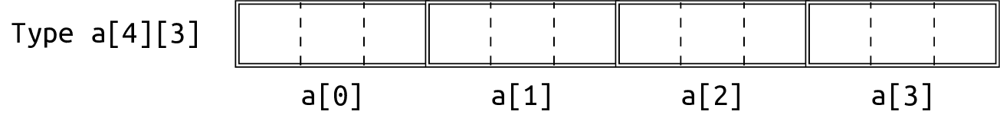

# CS100 Recitation 3

GKxx

---

## Contents

- 控制流（续）
- 函数
- 指针和数组

---

# 控制流

---

## `switch`-`case`

计算器：输入一个形如 `a op b` 的表达式，其中 `a` 和 `b` 是浮点数，`op` 是加减乘除中的某一个。输出表达式的值。

---

## `switch`-`case`

```c
int main(void) {
  double a, b;
  char op;
  scanf("%lf %c %lf", &a, &op, &b);
  if (op == '+')
    printf("%lf\n", a + b);
  else if (op == '-')
    printf("%lf\n", a - b);
  else if (op == '*')
    printf("%lf\n", a * b);
  else if (op == '/')
    printf("%lf\n", a / b);
  else
    printf("Invalid operator: %c\n", op);
  return 0;
}
```

---

## `switch`-`case`

<div style="display: grid; grid-template-columns: 1fr 1fr;">
  <div>

```c
int main(void) {
  double a, b;
  char op;
  scanf("%lf %c %lf", &a, &op, &b);
  if (op == '+')
    printf("%lf\n", a + b);
  else if (op == '-')
    printf("%lf\n", a - b);
  else if (op == '*')
    printf("%lf\n", a * b);
  else if (op == '/')
    printf("%lf\n", a / b);
  else
    printf("Invalid operator: %c\n", op);
  return 0;
}
```
  </div>
  <div>

```c
int main(void) {
  double a, b;
  char op;
  scanf("%lf %c %lf", &a, &op, &b);
  switch (op) {
  case '+':
    printf("%lf\n", a + b); break;
  case '-':
    printf("%lf\n", a - b); break;
  case '*':
    printf("%lf\n", a * b); break;
  case '/':
    printf("%lf\n", a / b); break;
  default:
    printf("Invalid operator: %c\n", op);
    break;
  }
  return 0;
}
```
  </div>
</div>

---

## `switch`-`case`

<div style="display: grid; grid-template-columns: 1fr 1fr;">
  <div>

```c
switch (op) {
  case '+':
    printf("%lf\n", a + b); break;
  case '-':
    printf("%lf\n", a - b); break;
  case '*':
    printf("%lf\n", a * b); break;
  case '/':
    printf("%lf\n", a / b); break;
  default:
    printf("Invalid operator: %c\n", op);
    break;
}
```
  </div>
  <div>

- `switch` 里的表达式必须具有整数类型（包括整数、字符、布尔、枚举）
- `case` 标签必须是整数类型**字面值**
- `default` 不是非得放在最后，而且可以没有
- 找到第一个匹配的 `case`，然后**一直执行到最后**或碰到第一个 `break` 退出。
- 缺少 `break`： [fallthrough](https://en.cppreference.com/w/c/language/attributes/fallthrough)
  </div>
</div>

---

## `switch`-`case`

intentional fallthrough：

```c
switch (letter) {
  case 'a':
  case 'e':
  case 'i':
  case 'o':
  case 'u':
    puts("vowel");
    break;
  default:
    puts("consonant");
    break;
}
```

---

## `case` 标签的作用域

```c
switch (a) {
  case 1:
    int x = 42;
  case 2:
    printf("%d\n", x);
    break;
}
```

- 如果 `a == 2`，`case 1` 中的语句理应跳过
- 但如果 `case 2` 里访问了 `case 1` 中定义的变量怎么办？

---

## `case` 标签的作用域

```c
switch (a) {
  case 1: {
    int x = 42;
  }
  case 2:
    printf("%d\n", x); // error: 'x' was not declared in this scope.
    break;
}
```

- 为了让作用域规则合理、统一，在 `case` 中定义的变量，其作用域必须用 `{}` 限定在 `case` 内部。

---

# 函数

---

## 函数的调用 (call) 和返回 (return)

<div style="display: grid; grid-template-columns: 1fr 1fr;">
  <div>

```c
#include <stdlib.h>
#include <stdio.h>

double divide(int a, int b) {
  if (b == 0) {
    fprintf(stderr, "Division by zero!\n");
    exit(EXIT_FAILURE);
  }
  return 1.0 * a / b;
}

int main(void) {
  int x, y; scanf("%d%d", &x, &y);
  double result = divide(x, y);
  printf("%lf\n", result);
  // ...
}
```
  </div>
  <div>

- 调用 `divide(x, y)` 时，首先用 `x, y` 初始化参数 `int a, int b`，犹如
  
  ```c
  int a = x;
  int b = y;
  ```
  然后控制流进入函数 `divide`，开始执行这里的第一条语句。
- `return` 做了两件事：
  - 从函数里传出一个值（可能没有），这个值传给了**调用点**。
  - 控制流回到**调用点**。
  </div>
</div>

---

## 函数的调用 (call) 和返回 (return)

<div style="display: grid; grid-template-columns: 1fr 1fr;">
  <div>

```c
#include <stdlib.h>
#include <stdio.h>

double divide(int a, int b) {
  if (b == 0) {
    fprintf(stderr, "Division by zero!\n");
    exit(EXIT_FAILURE);
  }
  return 1.0 * a / b;
}

int main(void) {
  int x, y; scanf("%d%d", &x, &y);
  double result = divide(x, y);
  printf("%lf\n", result);
  // ...
}
```
  </div>
  <div>

- 表达式 `divide(x, y)` 中的括号 `()` 称为**调用运算符** (function-call operator)
- 如果一个函数不接受任何参数，调用时仍然需要写上一对空的括号。
- 像 `f;` 这样只写函数名而不写括号是**能**通过编译的。
  - 一条什么都不做的语句
  - 类似于 `5;` `a + b;` `;` `{}` 等等。
  </div>
</div>

---

## 函数的调用 (call) 和返回 (return)

<div style="display: grid; grid-template-columns: 1fr 1fr;">
  <div>

```c
#include <stdlib.h>
#include <stdio.h>

double divide(int a, int b) {
  if (b == 0) {
    fprintf(stderr, "Division by zero!\n");
    exit(EXIT_FAILURE);
  }
  return 1.0 * a / b;
}

int main(void) {
  int x, y; scanf("%d%d", &x, &y);
  double result = divide(x, y);
  printf("%lf\n", result);
  // ...
}
```
  </div>
  <div>

- 返回值类型为 `void` 表示这个函数返回时不向调用点传递一个值。
- 如果返回值类型不是 `void`：
  - 必须由一条 `return` 语句来指出返回值是多少。
  - 如果执行到函数的末尾也没有碰到 `return` 语句，则返回值是**未定义的**，使用该返回值的行为是**未定义的行为**。
  </div>
</div>

---

## 一个小练习

写一个函数，询问用户是否同意（`Y`/`y`，`N`/`n`）。如果用户输入不正确就一直反复。

```c
bool yes_or_no(void) {
  while (true) {
    puts("Yes or no?");
    char input;
    scanf(" %c", &input);
    if (input == 'Y' || input == 'y')
      return true;
    if (input == 'N' || input == 'n')
      return false;
    puts("I can't understand.");
  }
}
```

---

## 函数的声明 (declaration) 和定义 (definition)

像这样给出了函数体（即给出了函数的所有信息），就是**定义**

```c
int sum(int a, int b) {
  return a + b;
}
```

**声明**一个函数，只需要给出其返回值类型、名字、各个参数的类型，用分号结束。

以下声明了同一个函数。

```c
int sum(int, int);
int sum(int x, int y);
int sum(int a, int);
```

---

## 函数的声明 (declaration) 和定义 (definition)

- 一个函数只能被定义一次，但可以被声明多次。
- 定义一个函数也相当于声明了这个函数。
- 调用一个函数时，在可见的范围内这个函数必须至少被声明了一次。

```c
int sum(int, int);
int main(void) {
  int x = sum(2, 3);
}
int sum(int x, int y) {
  return x + y;
}
```

---

## 函数的声明 (declaration) 和定义 (definition)

一条单独的声明有时是不可避免的：

```c
void f(void) {
  g(); // 找不到 g
}
void g(void) {
  f();
}
```

---

## 函数的声明 (declaration) 和定义 (definition)

一条单独的声明有时是不可避免的：

```c
void g(void);
void f(void) {
  g();
}
void g(void) {
  f();
}
```

---

## 函数的声明 (declaration) 和定义 (definition)

```c
void fun(void) {
  some_undeclared_func_name();
}
```

没找到这个函数，编译器会报什么错？

```
warning: implicit declaration of function ‘some_undeclared_func_name’
[-Wimplicit-function-declaration]
```

**居然只是一个 warning**？？

---

## 函数的声明 (declaration) 和定义 (definition)

在 C99 之前，如果调用了一个未在可见范围内声明的函数 `f`， 编译器会认为 `f` 被**隐式地声明** (implicitly declared)，且返回值类型为 `int`。

这个规定自 C99 开始被取消，但编译器仍然保留了这一行为，为的是兼容旧的代码。C++ 中从来没有这一规则。（试一试）

---

## 函数的声明 (declaration) 和定义 (definition)

令 C++ 选手们更加惊讶的是...

- 在 C23 之前，像 `T f();` 这样的声明，实际上声明了一个接受**未知**参数的函数，而 `T f(void);` 声明的是**不接受参数**的函数。
- 定义时参数列表空着也是这个意思，调用者可以随便传参数，只是你接不到罢了。


---

## 函数的声明 (declaration) 和定义 (definition)

令 C++ 选手们更加惊讶的是...

- 这也行？
  
  ```c
  void f();
  int main(void) {
    f(23, 45);
  }
  void f(int a, int b) {
    printf("%d, %d\n", a, b); // 输出 23, 45
  }
  ```

---

## 函数的声明 (declaration) 和定义 (definition)

令 C++ 选手们更加惊讶的是...

- 这也行？
  
  ```c
  void f();
  int main(void) {
    f(42); // undefined behavior
  }
  void f(int a, int b, int c) {
    printf("%d, %d, %d\n", a, b, c); // 输出 42 和两个垃圾值
  }
  ```

---

## 函数的声明 (declaration) 和定义 (definition)

函数是 C 语言历史遗留问题的重灾区之一...

```c
// 一种现在几乎没人用的函数定义方式，但它直到 C23 才退出标准。
int sum(a, b)
int a, b; {
  return a + b;
}
```

**不要声明能接受任意参数的函数**，它太容易引发未定义的行为。

大家再忍一忍，到 C++ 里 `f(void)` 的 `void` 就不用写了。

---

## 总结

- 函数的调用
  - 控制流从调用点跳转到函数体
  - 可以传一些参数进去
- 函数的返回
  - 控制流从函数体跳转到调用点
  - 可以传一个值出来（可以没有）
  - Non-void function 如果没有显式地返回一个值，则返回值是 undefined，使用这个值的行为是 undefined behavior。

---

## 总结

- 函数的声明
  - 不给出函数体
  - 需要给出返回值类型、函数名、各个参数的类型
  - 参数名可以不给，因为没有用到这些名字（没有函数体）
  - 可以声明多次，每次声明时参数的名字可以不同（因为没用）
- 函数的定义
  - 有函数体
  - 定义也是一种声明
  - 一个函数只能定义一次

---

# 指针和数组

---

## 指针 (pointer)

一个指针**指向**一个变量。指针所储存的**值**是它所指向的变量的内存地址。

```c
int i = 42;
int* pi = &i;
printf("%d\n", *pi);
```

- `int* pi` 声明了一个名为 `pi` 的指针，它指向的变量的类型是 `int`。
- `&` 是**取地址运算符**，用来获得一个变量的地址。
- `*pi` 中的 `*` 是**解引用运算符**，用来获得一个指针所指向的对象。

---

## 指针 (pointer)

```c
int i = 42;
int* pi = &i;
printf("%d\n", *pi); // 42
*pi = 35;
printf("%d\n", *pi); // 35
printf("%d\n", i);   // 35
```

---

## 指针 (pointer)

- **声明语句** `Type* p;` 中，`*` 表示声明的变量是**指针**。
- **表达式** `*p` 中的 `*` 是**解引用运算符**。
- 一个符号只有在**表达式**中才可能是**运算符**。

---

## 指针 (pointer)

`Type *p;` 和 `Type* p;` 是一样的：`*` 靠着谁都行，甚至可以 `Type * p;`
- 但是如果要声明多个指针，每个变量名前面必须都有一个 `*`：

  ```c
  int *p1, p2, *p3; // p1 和 p3 是 int *，但 p2 是 int
  int* q1, q2, q3;  // 只有 q1 是 int *，q2 和 q3 都是 int
  ```
- `Type* p` 可能更直观（“指针修饰符也是类型的一部分”），但它具有欺骗性。
- 选择一种并坚持。如果你选择 `Type* p`，不要在一条语句里定义多个指针。

---

## 指针 (pointer)

如果指针没有被显式初始化：

- 局部非静态：未初始化，拥有未定义的值——不知道指向哪。
- 全局或局部静态：**空初始化**，值是 `NULL`，即 `0`，即**空指针**。

也可以显式地让一个指针置空：`p = NULL;`

**`p = 0;` 也是合法的，但不推荐。**

事实上自 C++11 和 C23 起，标准都引入了更类型安全 (type-safe) 的空指针 `nullptr`。

**在 C++ 中，请使用 `nullptr` 而非 `NULL`。**

---

## 参数传递

```c
void fun(int x) {
  x = 42;
}
int main(void) {
  int i = 30;
  fun(i);
  printf("%d\n", i);
}
```

---

## 参数传递

```c
void fun(int x) {
  x = 42;
}
int main(void) {
  int i = 30;
  fun(i);
  printf("%d\n", i); // 30
}
```

传参的过程中，相当于发生了 `int x = i;` 这样的初始化。修改 `x` 的值并不会同时修改 `i` 的值。

---

## 参数传递

如果想要让函数修改外部变量的值，我们需要传递那个变量的地址。

```c
void fun(int *px) {
  *px = 42;
  // 将 px 指向的变量的值修改为 42，
  // 或者说，将 px 所表示的地址上存放的变量的值修改为 42。
}
int main(void) {
  int i = 30;
  fun(&i); // 传递 i 的地址
  printf("%d\n", i); // 42
}
```

---

## 参数传递

练习：写一个函数 `swap` 用来交换两个整数变量的值。请你自己设计这个函数的参数和返回值。

---

## 参数传递

练习：写一个函数 `swap` 用来交换两个整数变量的值。请你自己设计这个函数的参数和返回值。

```c
void swap(int *pa, int *pb) {
  int tmp = *pa;
  *pa = *pb;
  *pb = tmp;
}
int main(void) {
  int i = 42, j = 35;
  swap(&i, &j);
  // ...
}
```

**\* 为何 `scanf` 的参数需要取地址，而 `printf` 的参数不需要？**

---

## 参数传递

```c
void fun(int *px);
void foo(int x);
int main(void) {
  int i = 42, *p = &i;
  fun(p);              // int *px = p;
  fun(&i);             // int *px = &i;
  foo(i);              // int x = i;
}
```

参数传递实际上是用实参的值**初始化**形参。如果实参是一个变量，则相当于**拷贝**了这个变量的值。
- 如果是指针，则是**拷贝**了指针的值。在这一层面上，指针和普通变量并无区别。

---

## 未定义的行为

如果一个指针没有指向一个实际的对象：
- 它可能是未初始化的（俗称“野指针”）
- 可能是空指针
- 可能是指向的内存刚被释放掉（“空悬指针”）（下次课再说）
- 或者其它无意义的地址：`int *p = 123;`

试图解引用这个指针是 **undefined behavior**，并且通常是**严重的运行时错误**。

- 还记得逻辑运算符的“短路求值”吗？
  
  ```c
  if (p != NULL && *p == 42) { /* ... */ }
  ```

---

## 数组

一片连续的存储区域

```c
Type name[N];
```

`N`  必须是**常量表达式**：它的值能确定在编译时已知。

```c
int a1[10];   // 正确，字面值是常量表达式
#define MAXN 10
int a2[MAXN]; // 正确，MAXN 被预处理器替换为 10
int n;
scanf("%d", &n);
int a[n];     // 见下一页
```

---

## 数组

```c
int n;
scanf("%d", &n);
int a[n];
```

数组 `a` 的大小是运行期确定的，这样的数组称为 **Variable-Length Array (VLA)**。

- VLA 自 C99 被加入 C 语言标准，但 C11 起编译器有权决定是否支持它。
- 我们**不推荐**也**不允许**使用 VLA，OJ 编译时会带上 `-Werror=vla` 选项。
  - 等学了动态内存再解释不推荐的原因。
- C++14 时人们曾经讨论过是否在 C++ 中引入 VLA，但最终还是将它 vote out。
  - 等学 C++ 的时候再解释为何 C++ 难以支持 VLA。

可以看[我的博客](https://blog.csdn.net/qq_39677783/article/details/129219624?spm=1001.2014.3001.5501)

---

## 数组下标

可以用 `a[i]` 来访问数组 `a` 的第 `i` 个元素，读写都可以。

<div style="display: grid; grid-template-columns: 1fr 1fr;">
  <div>

```c
int a[10];

bool find(int value) {
  for (int i = 0; i != 10; ++i)
    if (a[i] == value)
      return true;
  return false;
}
```
  </div>
  <div>

```c
int main(void) {
  int n; scanf("%d", &n);
  for (int i = 0; i != n; ++i)
    scanf("%d", &a[i]);
  for (int i = 0; i != n; ++i)
    a[i] *= 2;
  // ...
}
```
  </div>
</div>

下标的范围是 $[0,N)$ 的整数。下标访问越界本质上等同于解引用无效的指针，是**未定义的行为**，并且是**严重的运行时错误**。

---

## 数组下标

下标的范围是 $[0,N)$ 的整数。下标访问越界本质上等同于解引用无效的指针，是**未定义的行为**，并且通常是**严重的运行时错误**。

还是那句话：编译器可以假定你的程序没有未定义的行为。

<div style="display: grid; grid-template-columns: 1fr 1fr;">
  <div>

```c
int a[10];

bool find(int value) {
  for (int i = 0; i <= 10; ++i)
    if (a[i] == value)
      return true;
  return false;
}
```
  </div>
  <div>

- 这段代码可能被直接编译为

  ```c
  bool find(int value) {
    return true;
  }
  ```

  [更多例子](https://en.cppreference.com/w/c/language/behavior)
  </div>
</div>

---

## 数组的初始化

和普通变量类似，如果没有显式初始化：
- 局部非静态的数组：未初始化，数组里的所有元素都具有未定义的值。
- 全局或局部静态的数组：**空初始化**，就是对数组里的所有元素进行**空初始化**。

但数组还有特殊的初始化规则...

---

## 数组的初始化

但数组还有特殊的初始化规则：[使用大括号初始值列表](https://en.cppreference.com/w/c/language/array_initialization#Initialization_from_brace-enclosed_lists)
- 可以对数组的前几个元素进行初始化：
  
  ```c
  int a[10] = {2, 3, 5, 7}; // Correct: Initializes a[0], a[1], a[2], a[3]
  int b[2] = {2, 3, 5};     // Error: Too many initializers
  int c[] = {2, 3, 5};      // Correct: 'c' has type int[3].
  int d[100] = {};          // Correct in C++ and since C23.
  ```
- 还可以使用 designators (since C99)：
  
  ```c
  int e[10] = {[0] = 2, 3, 5, [7] = 7, 11, [4] = 13};
  ```
---

## 数组的初始化

如果对数组进行了显式初始化，所有没有指定初始值的元素都被**空初始化**！

```c
int main(void) {
  int a[10] = {1, 2, 3}; // a[3] 及后续元素都是 0
  int b[100] = {0};      // b 的所有元素都是 0
  int c[100] = {1};      // c[0] 是 1，c[1] 及后续元素都是 0
  int d[100] = {};       // 自 C23 起合法，所有元素都是 0
}
```

**不要认为 `= {x}` 是将所有元素初始化为 `x`！**

---

## 多维数组

C 没有真正意义上的“多维数组”（[但 C++23 有多维下标运算符！！！](https://en.cppreference.com/w/cpp/language/operator_member_access#Built-in_subscript_operator)）

所谓的“多维数组”其实是数组的数组：

<a align="center">
  
</a>

```c
int a[10][20];

bool find(int value) {
  for (int i = 0; i != 10; ++i)
    for (int j = 0; j != 20; ++j)
      if (a[i][j] == value)
        return true;
  return false;
}
```

---

## 多维数组的初始化

[标准](https://en.cppreference.com/w/c/language/array_initialization#Nested_arrays)几乎已经说得非常清楚了。

```c
int a[4][3] = { // array of 4 arrays of 3 ints each (4x3 matrix)
    { 1 },      // row 0 initialized to {1, 0, 0}
    { 0, 1 },   // row 1 initialized to {0, 1, 0}
    { [2]=1 },  // row 2 initialized to {0, 0, 1}
};              // row 3 initialized to {0, 0, 0}
int b[4][3] = {    // array of 4 arrays of 3 ints each (4x3 matrix)
  1, 3, 5, 2, 4, 6, 3, 5, 7 // row 0 initialized to {1, 3, 5}
};                          // row 1 initialized to {2, 4, 6}
                            // row 2 initialized to {3, 5, 7}
                            // row 3 initialized to {0, 0, 0}
int y[4][3] = {[0][0]=1, [1][1]=1, [2][0]=1};  // row 0 initialized to {1, 0, 0}
                                               // row 1 initialized to {0, 1, 0}
                                               // row 2 initialized to {1, 0, 0}
                                               // row 3 initialized to {0, 0, 0}
```

---

## 指针的算术运算

对于指向 `Type` 类型的指针 `p` 和一个整数 `i`：
- `p + i` 得到的地址是 `(void *)p + i * sizeof(Type)`，即和 `p` 相距 `i` 个 `Type`。
- 所以如果让 `p = &a[0]`，那么 `p + i` 就等于 `&a[i]`，`*(p + i)` 就等价于 `a[i]`。

<a align="center">
  
</a>

- `i + p`, `p += i`, `p - i`, `p -= i`, `++p`, `p++`, `--p`, `p--` 等运算也是类似。

---

## 数组向指针的隐式转换

如果 `p = &a[0]`，那么 `p + i` 就等于 `&a[i]`，`*(p + i)` 就等价于 `a[i]`。

鉴于数组和指针有如此紧密的联系，C/C++ 允许数组**隐式转换**为指向其首元素的指针。

- `p = a[0]` 可以直接写成 `p = a`。
- `*a` 就是 `a[0]`。

---

## 数组向指针的隐式转换

如果 `p = &a[0]`，那么 `p + i` 就等于 `&a[i]`，`*(p + i)` 就等价于 `a[i]`。

鉴于数组和指针有如此紧密的联系，C/C++ 允许数组**隐式转换**为指向其首元素的指针。

- 可以用指针的方式遍历数组：
  
  ```c
  int a[10];

  bool find(int value) {
    for (int *p = a; p != a + 10; ++p)
      if (*p == value)
        return true;
    return false;
  }
  ```

---

## 指针相减

<a align="center">
  
</a>

如果指针 `p1` 和 `p2` 分别指向某一个数组的下标为 `i` 和 `j` 的位置，则 `p1 - p2`
- 的结果是 `i - j`，
- 类型为 `ptrdiff_t`：一个定义在 `<stddef.h>` 里的类型，是一种带符号整数，其具体大小是 implementation-defined。
  - 例如，在 64 位系统上 `ptrdiff_t` 可能是 64 位。
- 特别地，这里的 `i` 和 `j` 可以等于 `N`，即 `p1` 或 `p2` 指向数组的最后一个元素的**下一个**位置（“尾后”，past-the-end）

---

## 指针的算术运算

简单来说，指针的算术运算只能在一个数组内部以及“尾后”位置的范围内发生。

以下统统是 undefined behavior:

- `p1 - p2`，其中 `p1` 和 `p2` 指向两个不同的数组中的位置
- `p + 2 * N`，其中 `p` 指向某个长度为 `N` 的数组
- `p - 1`，其中 `p` 指向某个数组的首元素 `a[0]`

---

## 向函数传递数组

C 语言**没有办法**声明一个数组参数（为什么？），所以传递数组的唯一方式是传递**指向数组首元素的指针**。

以下四种声明是**完全等价的**：参数 `a` 的类型是 `int *`。（如何验证？）

```c
void fun(int *a);
void fun(int a[]);
void fun(int a[10]);
void fun(int a[2]);
```

---

## 向函数传递数组

C 语言**没有办法**声明一个数组参数（为什么？），所以传递数组的唯一方式是传递**指向数组首元素的指针**。

以下四种声明是**完全等价的**：参数 `a` 的类型是 `int *`。（如何验证？）

```c
void fun(int *a);
void fun(int a[]);
void fun(int a[10]);
void fun(int a[2]);
```

验证：使用 `sizeof` 获得一个变量或类型所占的字节数。

---

## 向函数传递数组

就算以数组的形式声明一个参数，它的类型也是一个普通的指针：传递任何一个地址给它都是合法的，传递任何大小的数组给它也是合法的。

> 为何使用 `scanf`、`gets` 之类的函数读取字符串被视为不安全的？

为了让函数知道这个数组究竟有多长，常见的方法是**显式地传递一个参数 `n`**：

```c
void print_array(int *a, int n) {
  for (int i = 0; i != n; ++i)
    printf("%d ", a[i]);
}
```

**\* 指针也能用下标？**

---

## 向函数传递数组

练习：设计并编写一个函数，将一个整数数组里的奇数倒序拷贝给另一个数组。

---

## 向函数传递数组

练习：设计并编写一个函数，将一个整数数组里的奇数倒序拷贝给另一个数组。

```c
void copy_odd_reversed(int *from, int n, int *to) {
  for (int i = n - 1, j = 0; i >= 0; --i)
    if (from[i] % 2 == 1)
      to[j++] = from[i];
}
```

---

## 指针也能用下标？

看看[标准](https://en.cppreference.com/w/c/language/operator_member_access#Subscript)，你会发现下标运算符的语法是

- `pointer[integer]`
- `integer[pointer]`

也就是说：

- 下标运算符在语法上是为指针提供的，取数组的下标 `a[i]` 时实际上也发生了数组向首元素指针的隐式转换
- 不仅可以 `p[i]`，还可以 `i[p]` ~~是不是很奇怪~~
- 你只要知道“数组和指针都可以用下标”就行了，不是非得记住谁向谁转换。

---

## 数组向指针的隐式转换

事实上[这种隐式转换无处不在](https://en.cppreference.com/w/c/language/conversion#Array_to_pointer_conversion)：

> Any lvalue expression of array type, when used in any context **other than**
> 
> - as the operand of the address-of operator (`&`)
> - as the operand of `sizeof`
> - as the string literal used for array initialization
> 
> undergoes a conversion to the non-lvalue pointer to its first element.

以至于某些人会告诉你“数组名就是指针”，**但这是不对的！**

---

## 总结

- 指针基础
  - 声明/定义一个指针
  - 解引用 `*`、取地址 `&`
  - 传指针参数来让函数修改外部变量
- 数组基础
  - 一片连续的内存
  - 数组大小必须是常量表达式
  - 下标访问、遍历
  - 多维数组：其实是“数组的数组”

---

## 总结

- 指针的算术运算
  - 必须在某一个数组的范围内（也可以是“尾后”位置），否则是 undefined behavior
- 数组向指向首元素的指针的隐式转换
  - `p = a` 等价于 `p = &a[0]`
- 可以用指针遍历数组
- 向函数传递数组：只能传递首元素的指针，通常需要传递一个额外的参数表示长度
- 数组和指针共用一套运算（包括算术运算和下标），但**它们是不同的类型**。

---

## 总结

访问无效的内存是 undefined behavior，通常是严重的运行时错误，并且是 C/C++ 饱受诟病的内存安全问题的原因之一，也和一些常见的攻击手段有关。

包括但不限于

- 空指针、野指针、悬置指针的解引用
- 下标访问越界
- 指针运算超出数组（包括“尾后”）范围，哪怕不解引用也是 undefined behavior

  > Note that executing `p-1` when `p` points at the first element of an array is undefined behavior and may fail on some platforms.

- `scanf`、`gets` 读字符串：它们根本不知道缓冲区大小是多少！
