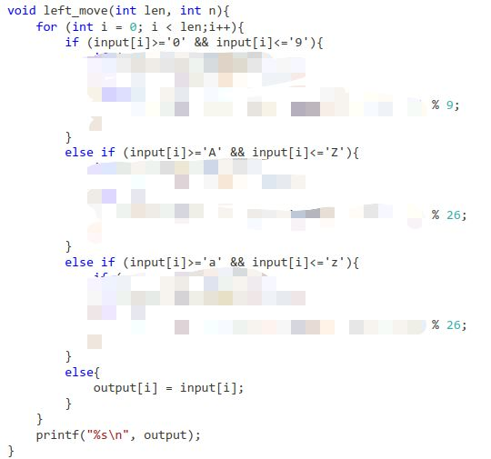
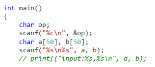

# CS100 Recitation 5

GKxx

---

# Contents

Homework 2 讲解，如何 debug，如何写出容易 debug、容易维护的代码。

---

## 1. Happy Coding

输入 $n$ 个数，倒序输出所有正数的平方

---

## 1. Happy Coding

输入 $n$ 个数，倒序输出所有正数的平方

**注意数据范围**

- `int` 的范围是多大？`long` 呢？`long long` 呢？
- `long long result = ival * ival;` 会溢出吗？溢出的后果是什么？

---

## 1. Happy Coding

输入 $n$ 个数，倒序输出所有正数的平方

**注意数据范围**

- `int` 的范围是多大？`long` 呢？`long long` 呢？
  - `sizeof(int) >= 2`，通常是 `4`。
  - `sizeof(long) >= 4`，通常是 `4` 或者 `8`。
  - `sizeof(long long) >= 8`，通常是 `8`。
  - `sizeof(int) <= sizeof(long) <= sizeof(long long)`
- `long long result = ival * ival;` 会溢出吗？溢出的后果是什么？
  - **会**：计算 `ival * ival` 时已经溢出。带符号整数溢出是 **undefined behavior**

---

## 1. Happy Coding

输入 $n$ 个数，倒序输出所有正数的平方

开数组之前问一下你自己：真的需要开这个数组吗？

```c
for (int i = 0; i != n; ++i)
  scanf("%d", &a[i]);
int cnt = 0;
for (int i = n - 1; i >= 0; --i)
  if (a[i] > 0) {
    printf("%lld\n", 1ll * a[i] * a[i]);
    ++cnt;
  }
printf("%d\n", cnt);
```

---

## 2. Quadratic Equation

输入一元方程 $ax^2+bx+c=0$ 的三个系数，按要求输出方程的解。

- （本应该）唯一的坑点：输出 `x\in\mathbb{R}` 时，`'\'` 需要转义
- 实际出现的坑点：如何判断两个根谁大谁小？
  - 初中老师流下了伤心的泪水

注意：题目保证了输入的 $a$, $b$, $c$ 都是**整数**。**不要随便用浮点数代替整数**

---

## 3. Hexadecimal Calculator

输入两个十六进制数，以及一个运算（加或减），列竖式计算其结果。

**真正的难题，所以一会儿再说**

---

## 4. Bit Operation

将一个整数 $x$ 拆分成末 $m+1$ 位和剩下的部分，交换后拼成一个新的数，并计算最右边的 $1$ 是第几位

**完全不需要用数组的题，但大家都在开数组**

---

## 4. Bit Operation

第一个问题：“进制”（和第三题也有关）

- “数”有“进制”吗？
- `int` 是几进制数？
- $42$ 是几进制数？$101010_{\text{two}}$ 是几进制数？
- 设 $x\in\mathbb R$。$x$ 是几进制数？$x^2$ 是几进制数？

---

## 4. Bit Operation

**“数”没有“进制”的属性**，只有当它被读或被写出来时才有。

- 计算机中一切都是二进制，人脑中的计算常用十进制
- 但这不妨碍计算机算出人脑认可的值。
- 运算的定义、结果都不受进制的影响，受影响的是计算的方式

---

## 位运算

| 按位与  | 按位或   | 按位异或 | 左移     | 右移     | 位求反 |
| ------- | -------- | -------- | -------- | -------- | ------ |
| `a & b` | `a \| b` | `a ^ b`  | `a << i` | `a >> i` | `~a`   |

以及复合赋值运算符 `a &= b`, `a |= b`, `a ^= b`, `a <<= i`, `a >>= i`

- `a & b` 的第 $i$ 位是 `1` 当且仅当 `a` 和 `b` 的第 $i$ 位都是 `1`。
- `a | b` 的第 $i$ 位是 `1` 当且仅当 `a` 和 `b` 的第 $i$ 位至少有一个是 `1`。
- `a ^ b` 的第 $i$ 位是 `1` 当且仅当 `a` 和 `b` 的第 $i$ 位不同。
- `~a` 的第 $i$ 位是 `1` 当且仅当 `a` 的第 $i$ 位是 `0`。

---

## 位运算

| 按位与  | 按位或   | 按位异或 | 左移     | 右移     | 位求反 |
| ------- | -------- | -------- | -------- | -------- | ------ |
| `a & b` | `a \| b` | `a ^ b`  | `a << i` | `a >> i` | `~a`   |

以及复合赋值运算符 `a &= b`, `a |= b`, `a ^= b`, `a <<= i`, `a >>= i`

- `a << i` 将 `a` 整体往左移 $i$ 位，左边的位（高位）被去掉，右边多出来的位为 `0`
- `a >> i` 将 `a` 整体往右移 $i$ 位，右边的位（低位）被去掉，左边多出来的位为 ？

  - 暂时只考虑非负整数的情形，右移时左边多出来的位为 `0`。
  - logical shift vs. arithmetic shift

---

## 位运算

暂时只考虑非负整数的情形

- `x * 2`：`x << 1`
- `x / 2`：`x >> 1`
- $2^i$：`1 << i`，但这是 `int`。如果超出 `int` 范围，可以 `1L << i` 或 `1LL << i`
  - **不要用 `pow`！`pow` 是浮点数函数，精度有限**
  - 试一试：$10^{20}+1-10^{20}$ 和 $10^{20}-10^{20}+1$
- `x % 2`：`x & 1`

---

## 4. Bit Operation

将一个整数 $x$ 拆分成末 $m+1$ 位（$p$）和剩下的部分（$q$），交换后拼成一个新的数 $y$，并计算最右边的 $1$ 是第几位

- `q = x >> (m + 1);`
- 如何获得 `p`？

---

## 4. Bit Operation

将一个整数 $x$ 拆分成末 $m+1$ 位（$p$）和剩下的部分（$q$），交换后拼成一个新的数 $y$，并计算最右边的 $1$ 是第几位

- `q = x >> (m + 1)`
- 如何获得 `p`？
  - `p = x - (q << (m +1))`
  - 另一种方法：构造一个数 $00\cdots 011\cdots 1_{\text{two}}$（末 $m+1$ 位为 `1`），然后和 $x$ 按位与一下
  - `p = x & ((1LL << (m + 1)) - 1)`

---

## 4. Bit Operation

将一个整数 $x$ 拆分成末 $m+1$ 位（$p$）和剩下的部分（$q$），交换后拼成一个新的数 $y$，并计算最右边的 $1$ 是第几位

- 假设 `q` 有 `L` 位，那么拼接出来的新数就是 `y = (p << L) + q`
  - `p << L` 把 `q` 的位置腾出来，然后加上 `q` 就行
  - 需要计算一个数的二进制表示有多少位：不断除以 `2`（不断右移 `1`），直到得到 `0` 为止。

---

## 4. Bit Operation

将一个整数 $x$ 拆分成末 $m+1$ 位（$p$）和剩下的部分（$q$），交换后拼成一个新的数 $y$，并计算最右边的 $1$ 是第几位

- 计算最右边的 $1$ 是第几位：从小到大枚举 `i`，判断第 `i` 位是不是 `1`。
  - 看 `y & (1LL << i)` 是否非零，或者看 `(y >> i) & 1` 是否为 `1`。

---

## 5. No-Horse Sudoku

给一个数独局面，判断是否合法。需要检查行、列、宫、八个马。

**输入一个二维数组**

```c
for (int i = 0; i != 9; ++i)
  for (int j = 0; j != 9; ++j)
    scanf("%d", &board[i][j]);
```

**`"%d"` 会跳过前导的空白！！！！！不要再写愚蠢的 `'\n'`、`' '` 了！！！**

---

## 5. No-Horse Sudoku

给一个数独局面，判断是否合法。需要检查行、列、宫、八个马。

**输入一个二维数组**

“会循环，但不完全会”型：

```c
for (int i = 0; i != 9; ++i)
  scanf("%d %d %d %d %d %d %d %d %d",
        &board[i][0], &board[i][1], &board[i][2],
        &board[i][3], &board[i][4], &board[i][5],
        &board[i][6], &board[i][7], &board[i][8]);
```

---

## 5. No-Horse Sudoku

给一个数独局面，判断是否合法。需要检查行、列、宫、八个马。

框架：枚举每个位置，判断单个位置是否合法

```c
int main(void) {
  // ... input
  for (int i = 0; i != 9; ++i)
    for (int j = 0; j != 9; ++j)
      if (!checkOneNumber(board, i, j)) {
        puts("0"); // 不需要 printf("%d", 0);
                   // 更不需要 int x = 0; printf("%d", x);
        return 0;
      }
  puts("1");
  return 0;
}
```

---

## 5. No-Horse Sudoku

检查一个位置是否合法：

```c
bool checkOneNumber(int board[9][9], int row, int col) {
  return checkRow(board, row, col)
         && checkCol(board, row, col)
         && checkPalace(board, row, col)
         && checkHorses(board, row, col);
}
```

我的代码不需要注释了？

---

## 5. No-Horse Sudoku

检查行、列：直接枚举这一行/列判断就行

```c
bool checkRow(int board[9][9], int row, int col) {
  for (int c = 0; c != 9; ++c)
    if (c != col && board[row][col] == board[row][c])
      return false;
  return true;
}
```

---

## 5. No-Horse Sudoku

检查宫：先计算出这个宫的左上角的坐标，然后枚举偏移量

```c
bool checkPalace(int board[9][9], int row, int col) {
  int rStart = row / 3 * 3, cStart = col / 3 * 3;
  for (int i = 0; i != 3; ++i)
    for (int j = 0; j != 3; ++j) {
      int r = rStart + i, c = cStart + j;
      if ((r != row || c != col) && board[row][col] == board[r][c])
        return false;
    }
  return true;
}
```

`row / 3 * 3, col / 3 * 3` 这个计算太难想啦，但也没有超过小学二年级难度。

---

## 5. No-Horse Sudoku

检查马：关键是如何以优雅的方式枚举八个马的位置。

```c
bool checkHorses(int board[9][9], int row, int col) {
  if (board[row - 1][col - 2] == board[row][col])
    return false;
  if (board[row - 2][col - 1] == board[row][col])
    return false;
  if (board[row - 2][col + 1] == board[row][col])
    return false;
  // ...
}
```

冗长，重复，而且你还忘记判断越界了。

---

## 5. No-Horse Sudoku

检查马：仍然考虑**偏移量**

- 别说 8 个马，再复杂的规则也一样

```c
bool checkHorses(int board[9][9], int row, int col) {
  static const int dr[] = {-1, -2, -2, -1, 1, 2, 2, 1};
  static const int dc[] = {-2, -1, 1, 2, 2, 1, -1, -2};
  for (int i = 0; i != 8; ++i) {
    int r = row + dr[i], c = col + dc[i];
    if (validCoord(r, c) && board[row][col] == board[r][c])
      return false;
  }
  return true;
}
```

`validCoord` 是啥？你急什么，又不是写不出来

---

## 5. No-Horse Sudoku

- 检查一个元素是否合法的关键：**以合理、优雅的方式 `for` 出所有关键的位置**
- 学会写清晰的、简洁的、self-documenting 的代码：
  
  ```c
  return checkRow(board, row, col) && checkCol(board, row, col)
         && checkPalace(board, row, col) && checkHorses(board, row, col);
  ```
  如果这是一个组队任务，接下来你们就可以分工了

---

## 5. No-Horse Sudoku

开数组、拷贝数据、开内存这种事，**三思而后行**。
- 你真的需要开这个数组吗？真的需要把所有的东西都记下来才好干活吗？（hw3/4）
- 什么时候你需要拷贝一笔数据？
- 不仅影响效率，也会增加代码的复杂性，也增加你命名的难度
- 代码中同时存在 `name`, `Name`, `name1`, `name_1`, `name2`, `name_2` 这样的东西，将大大增加你 debug 的难度

---

## 3. Hexadecimal Calculator

输入两个十六进制数，以及一个运算（加或减），列竖式计算其结果。

**数据范围**：50 位十六进制数，是多大？

---

## 3. Hexadecimal Calculator

输入

- 可以以字符串的方式读入，也可以手动一个字符一个字符读
- 读进来可以存成字符，也可以存对应的十六进制数值
- **如果是字符串，记得给 `'\0'` 留位置**

---

## 3. Hexadecimal Calculator

数位对齐

- 可以给短的数前面补零，也可以把两个数都反过来
- 无论哪一种方法，都会出现重复的代码。**提出来作为一个函数**。

---

## 3. Hexadecimal Calculator

计算加减法

- 一位一位算，可以同时处理进退位，也可以先算完再统一处理
- **避免重复**！

  ```c
  for (int i = 0; i != length; ++i)
    result[i] = to_int(a[i]) + to_int(b[i]);
  ```

- 可以是 `to_int(a[i])`，也可以是 `to_int[a[i]]`，但后者比前者麻烦一点。

  ```c
  int to_int(char c) {
    if (c <= '9')
      return c - '0';
    else
      return c - 'a' + 10;
  }
  ```

---

## 3. Hexadecimal Calculator

```c
for (int i = 0; i != length; ++i)
  result[i] = to_int(a[i]) + to_int(b[i]);
```

不好的写法：

```c
for (int i = 0; i != length; ++i) {
  int x, y;
  if (a[i] <= '9')
    x = a[i] - '0';
  else
    x = a[i] - 'a' + 10;
  if (b[i] <= '9')
    y = b[i] - '0';
  else
    y = b[i] - 'a' + 10;
  result[i] = x + y;
}
```

---

## 3. Hexadecimal Calculator

完全没学过 ASCII 的写法：

```c
for (int i = 0; i != length; ++i) {
  int x, y;
  if (a[i] == '0') x = 0;
  if (a[i] == '1') x = 1;
  // ...
  if (a[i] == 'a') x = 10;
  if (a[i] == 'b') x = 11;
  if (a[i] == 'c') x = 12;
  // ...
  if (b[i] == '0') y = 0;
  if (b[i] == '1') y = 1;
  // ...
  if (b[i] == 'a') y = 10;
  if (b[i] == 'b') y = 11;
  if (b[i] == 'c') y = 12;
  // ...
  result[i] = x + y;
}
```

---

## 3. Hexadecimal Calculator

输出

- 字符串**直接用 `puts(s)` 或 `printf("%s", s)`！！不要一个字符一个字符往外蹦！**
  - 要从第 `i` 位开始输出，只要 `puts(s + i)` 或 `printf("%s", s + i)`
  - 如果你需要倒着输出... 那只能自己写了
- 减法注意去掉结果中的前导 `0`，但也有可能这个数就是 `0`，注意特判。

---

## 如何写出好的代码？

1. 先想清楚整体的流程。
2. 对于细节和重复的部分，提出来写成函数
   - 在想流程的时候，只考虑这些函数“需要什么”、“做什么事”、“返回什么”
3. 善用 `assert`：**防御性编程**
   - 用 `assert` 将一些必要的假设、约定写进代码里，一旦违反就有报告。
   - 在开头 `#define NDEBUG` 或编译时 `-DNDEBUG` 就可以关闭所有 `assert`，防止 `assert` 影响最终的程序的效率。
4. **避免重复！！**

---

## 善用 `assert`

`#include <assert.h>`

- 将你想象中的应该成立的条件打在公屏上

```c
void add_leading_zeros(char *str, int num_of_zeros) {
  int len = strlen(str);
  for (int i = len; i >= 0; --i)
    str[i + num_of_zeros] = str[i];
  for (int i = 0; i != num_of_zeros; ++i)
    str[i] = '0';
  assert(strlen(str) == len + num_of_zeros);
}
```

---

## 善用 `assert`

```c
int to_int(char c) {
  assert(isxdigit(c) && !isupper(c));
  if (isdigit(c))
    return c - '0';
  else
    return c - 'a' + 10;
}
char to_hexchar(int x) {
  assert(x >= 0 && x <= 15);
  if (x <= 9)
    return x + '0';
  else
    return x - 10 + 'a';
}
```

---

## 善用 `assert`

```c
char to_hexchar(int x) {
  assert(x >= 0 && x <= 15);
  if (x <= 9)
    return x + '0';
  else
    return x - 10 + 'a';
}
void print_result(int *result, int length) {
  assert(length >= 1);
  assert(length <= len_a && length <= len_b);
  for (int i = 0; i != length; ++i)
    putchar(to_hexchar(result[i]));
  puts("");
}
```

---

## 善用 `assert`

```c
assert(max_len >= 1);
// 处理进位
for (int i = 0; i < max_len - 1; ++i) {
  if (result[i] >= 16) {
    ++result[i + 1];
    result[i] -= 16;
    assert(result[i] >= 0 && result[i] <= 15);
  }
}
// 最高位不会进位
assert(result[max_len - 1] >= 0 && result[max_len - 1] <= 15);
```

---

## 如何写出好的代码？

程序的 bug 大致分为两类：

- 没想好就乱写
- 想的和写的不同义

`assert`、`const` 等特性存在的意义之一：让程序自动检查一些假设、约定是否成立。

---

## 充分了解你用的每个东西

- `long long` 的范围到底是多大？
- `char` 的范围是多大？
- `atoi` 跳不跳过空白？在遇到错误时会怎样？
- `scanf` 读入时到底会不会跳过空白？
- `'\0'` 和 `0` 一样吗？
- `char str[50] = "\0";` 是在干什么？`char str[50] = {'0'};` 是在干什么？
- `"hello"` 的类型是什么？

---

## 充分了解你用的每个东西

- `fgets` 至多读多少个字符？读不读换行？存不存换行？会不会放空字符？
- `scanf("%s", ...)` 的行为？`scanf("%c", ...)` 的行为？
- `pow` 的参数和返回值是什么类型？
- 上网查来的代码 `while ((ch = getchar()) != EOF && ch != '\n') {}` 是什么意思？

---

## 常见的误区

- “能跑就行，规范不规范回头再说”
- “XXX 是大佬的做法，我只要用 YYY 就好了”
- “我先用一个笨办法让它跑起来，这样比较稳妥”
- 迷信玄学：“虽然题目保证了结果非负，但考虑负数会多过几个点”

有时候不是你 debug 能力不行，而是**你写的那个代码没法 debug**

- 不要畏惧新的知识、更好的方法：**学习就是不断推翻自己的过程**

---

## Debug 和测试

> 机器永远是对的，未经测试的程序永远是错的。——南京大学 JYY

第一步：解决所有的编译错误和 warning

- 虽然 C/C++ 的某些编译报错难以理解（可能是由于历史遗留问题），但编译器给出的信息仍然是第一线索。
- 遇到一长串报错时，**首先解决最上面的那条**通常是有效的办法。
  - 编译器一旦遇到了一个错误，后面可能就不知所措了
- 理解编译器的报错，不要急着上网查
  
---

## Debug 和测试

理解编译器的报错，不要急着上网查

```python
---> initial = np.random.rand((num, 2))
TypeError: `tuple` object cannot be interpreted as an integer
```

> “这个咋办？我查了下是说矩阵不能这么算，但我寻思之前我写的也是矩阵啊？”
> “但我其实是想搞个 num * 2 的矩阵”
> “所以是写随机矩阵这个写法也不对？”

---  

## Debug 和测试

> 计算机的世界没有魔法。——南京大学 JYY

遇到问题应该解决问题，而不是解决提出问题的人（产生问题的东西）。

> ——“这里写这么麻烦干什么？你为什么不用 XXX？”
> ——“因为改用 XXX 之后会报错”
> ——“报的什么错？”
> ——“不知道”
> ——“然后你就改成这种写法了？”
> ——“嗯...”

---

## Debug 和测试

> 计算机的世界没有魔法。——南京大学 JYY

“凭经验猜，凭直觉猜，凭意大利纸牌猜，或者请碟仙”

> “我现在的代码用了 malloc 和 calloc 但是都有 free”
> “然后还用了个 fgets”
> “fgets 里有个 stdin”
> “会不会是这个 stdin 的问题”

---

## 测试

测试的关键是**造数据**：

- 仔细考虑可能的 case，尝试构造出让你的程序出错的数据
- `1+1`、`aaaaa-aaaaa`、`aaaaa-a0000` 这样的数据太弱了
- 可能出错的点：进位、退位、结果为零、长度达到上界 50 等。
- 找出一个有效的数据后，就可以开始 debug 了。

批量生成测试数据？通常用 Python 或者 Shell Script，虽然 C/C++ 也不是不行。

---

## Debug

抓着一个有效的数据开始调试

- 将程序大致分为几个部分（最好在写的时候就想清楚这一点），一步一步检查每个部分的功能是否正常
- 可以通过 debugger 或者 print-statement 的方式检查
- print-statement 虽然原始，但也是十分有效的方法（我整个竞赛生涯都是这样 debug 的）
- 以后你们会真正需要更高级的 debug 功能，以后再说

---

## Debug

其实 debug 没有什么捷径/魔法

- 瞪眼法/小黄鸭
- print-statement
- 使用工具：GDB, strace, sanitizer, valgrind, Visual Studio

当年我们竞赛的教练这样讲，[CppCon2022 的 talk](https://www.bilibili.com/video/BV1FB4y1H7VS?p=6&vd_source=7940495b5667750a71bfa10a4c6eb2d9) 也这样讲

---

<a align="center">
  
</a>

---

本可以通过瞪眼法看出的错误

<a align="center">
  
</a>

但如果你不知道字符串末尾有 `'\0'`，就没办法了。